# DeepGEMM Mega MoE 完整技术指南

> PR: [#304 — Public release 26/04: Introducing Mega MoE, FP4 Indexer and other features/fixes](https://github.com/deepseek-ai/DeepGEMM/pull/304)
>
> 配套 draw.io 图表（单文件 3 页）：[`mega_moe_diagrams.drawio`](mega_moe_diagrams.drawio)
>  - 页 ①：整体运算流程
>  - 页 ②：Warp 时序
>  - 页 ③：数据流与内存层级

---

## 文档结构

本指南由三个章节组成，按"是什么 → 怎么做 → 为什么"的顺序深入：

| 章节 | 主题 | 面向 |
|------|------|------|
| [第一章：PR #304 技术报告](#第一章pr-304-技术报告) | 整体架构、特性、性能、适用场景、编译测试指南 | 产品 / 架构决策者 |
| [第二章：Warp 级计算流程深度分析](#第二章warp-级计算流程深度分析) | 16 个 warp 的角色分配、指令级执行流、完整时间线 | 实现 / 调试工程师 |
| [第三章：设计原理与技术深度解析](#第三章设计原理与技术深度解析) | 为什么这样设计、优化流程图、Q&A、关键技术点 | 设计 / 面试 / 深度复盘 |

---

# 第一章：PR #304 技术报告

### 1. PR 概览

| 维度 | 数据 |
|------|------|
| 代码变更 | +12,135 / -3,253 行 |
| 涉及文件 | ~90 个 |
| 核心贡献者 | @LyricZhao @zheanxu @bucket-xv @RayWang96 @interestingLSY @kurisu6912 @xay5421 @yukuai26 |

#### 核心特性

| 特性 | 说明 |
|------|------|
| **Mega MoE** | EP Dispatch / Linear1(FP8×FP4) / SwiGLU / Linear2(FP8×FP4) / EP Combine 融合为单个 mega-kernel，NVLink 通信与 Tensor Core 计算重叠 |
| **FP4 Indexer** | SM100 FP4 MQA logits scoring kernel，支持更大 MTP |
| **FP8×FP4 GEMM** | 新增混合精度 GEMM |
| **PDL** | Programmatic Dependent Launch 支持 |
| **Swap A/B** | MoE GEMM 性能优化（交换 A/B 操作数以利用 multicast） |
| **DeepEPv2 Layout** | MoE GEMM 的 psum layout 支持 |
| **JIT 加速** | 更快的编译、include parser、C++20 升级 |
| **Bug 修复** | 分布式 FS 上的 JIT 崩溃、部分 kernel hang 和 IMA 问题 |

---

### 2. Mega MoE 核心架构

#### 2.1 整体运算流程

Mega MoE 将 MoE FFN 的**完整流水线**（跨节点通信 + 计算）融合为单个 CUDA kernel。

**核心文件：**

| 文件 | 行数 | 职责 |
|------|------|------|
| `deep_gemm/include/deep_gemm/impls/sm100_fp8_fp4_mega_moe.cuh` | 1364 | 主 Kernel 实现 |
| `deep_gemm/include/deep_gemm/scheduler/mega_moe.cuh` | 221 | Wave-based 调度器 |
| `deep_gemm/include/deep_gemm/layout/mega_moe.cuh` | 255 | 内存布局与 Workspace |
| `deep_gemm/include/deep_gemm/comm/barrier.cuh` | 74 | Grid sync + NVLink barrier |
| `deep_gemm/include/deep_gemm/layout/sym_buffer.cuh` | 41 | Symmetric memory 抽象 |
| `csrc/apis/mega.hpp` | 216 | C++ API 入口 |
| `csrc/jit_kernels/heuristics/mega_moe.hpp` | 211 | 配置启发式 |
| `csrc/jit_kernels/impls/sm100_fp8_fp4_mega_moe.hpp` | ~210 | JIT kernel 包装 |
| `deep_gemm/mega/__init__.py` | 128 | Python 接口 |

**端到端数据流：**

```
Input tokens (FP8, 各 rank 本地) + TopK Routing (topk_idx, topk_weights)
       │
       ▼
  ┌─────────────────────────────────────────────────────────────────┐
  │                     单个 Mega Kernel (Persistent)                │
  │                                                                 │
  │  Phase 1: Dispatch (NVLink Pull)                                │
  │    → 读取 topk_idx，统计各 expert token 数量                      │
  │    → Grid sync + NVLink barrier 跨 rank 同步                    │
  │    → 通过 NVLink TMA 拉取远程 token/SF/weights 到本地 L1 buffer   │
  │                                                                 │
  │  Phase 2: Linear1 (FP8 × FP4 GEMM)                             │
  │    → x @ W1^T → [gate, up] (gate/up interleaved layout)         │
  │    → 2-CTA cluster MMA with multicast on A (Swap A/B)           │
  │                                                                 │
  │  Phase 3: SwiGLU (fused in L1 epilogue)                         │
  │    → SiLU(gate) × up × topk_weight                              │
  │    → 在线 Amax 跨 warp 归约 + FP8 量化                           │
  │    → TMA store 中间结果到 L2 buffer                              │
  │                                                                 │
  │  Phase 4: Linear2 (FP8 × FP4 GEMM)                             │
  │    → swiglu_out @ W2^T → BF16 output                            │
  │    → 等待 L1 output 就绪 (l2_arrival_mask bitmask)               │
  │                                                                 │
  │  Phase 5: Combine (NVLink Push + Reduce)                        │
  │    → BF16 结果通过 NVLink 写入远程 combine buffer                  │
  │    → NVLink barrier 同步                                         │
  │    → TMA load top-k 结果 + FP32 累加 → BF16 最终输出              │
  └─────────────────────────────────────────────────────────────────┘
       │
       ▼
  Output y (BF16, [num_tokens, hidden])
```

#### 2.2 为什么可以合并为一个 Kernel

**合并的五个核心逻辑：**

**1. 数据局部性（Producer-Consumer Chain）**

MoE 的 5 个阶段之间存在严格的生产者-消费者关系。分开成多个 kernel 时，中间数据必须写回 HBM 再读取。合并后，L1 output 留在 symmetric memory 中（实际上就是同一块 GPU memory 的不同区域），直接被 L2 消费，避免了额外的 HBM round-trip。

**2. 通信-计算重叠（Communication-Computation Overlap）**

传统方案中，NVLink dispatch/combine 和 GEMM 计算是串行的（不同 kernel 之间无法重叠）。Mega kernel 通过 **warp 角色分工** 实现真正的硬件级重叠：

- Dispatch warps 在 NVLink 拉取后续 token 数据的同时，GEMM warps 已经在处理先到达的 expert blocks
- Combine warps 写回远程数据时，Dispatch warps 可以同时清理 workspace 准备下一次调用

**3. 细粒度同步（Per-block Arrival）**

使用 arrival count + bitmask 机制实现 per-block 级别的 L1→L2 数据就绪通知，无需全局 barrier：

- `l1_arrival_count`：每个 pool block 的 token 全部 TMA store 完成后原子递增，L2 的 TMA load warp 轮询等待
- `l2_arrival_mask`：L1 epilogue 完成每个 N block 后设置对应 bit（`atomic OR`），L2 按 K block 粒度检查 2 个相邻 bit

**4. Persistent Kernel**

所有 SM 上的 thread blocks 在整个 MoE 生命周期内持续运行，通过 `MegaMoEScheduler` 动态获取下一个工作块（`for_each_block`），避免了多次 kernel launch 的开销和 GPU idle gap。

**5. Symmetric Memory**

利用 PyTorch 2.9 的 `torch.distributed._symmetric_memory`，所有 rank 的缓冲区映射到统一虚拟地址空间。`SymBuffer::map(ptr, dst_rank_idx)` 将本地指针通过预计算的偏移量直接映射到远程 rank 的对应地址，kernel 内可直接通过 NVLink 进行 load/store，无需任何 host-side 通信 API 调用。

---

### 3. Thread 和 Block CUDA Dispatch 方式

#### 3.1 Grid 和 Block 配置

```
Grid:     (num_sms, 1, 1)       — persistent kernel，每个 SM 恰好一个 block
Block:    (512, 1, 1)           — 128 + 128 + 256 threads
Cluster:  2-CTA                 — 2 个 thread block 组成 1 个 cluster
Launch:   __launch_bounds__(kNumThreads, 1)
```

#### 3.2 Warp 角色分配

```
Thread 分布 (16 warps, 512 threads per CTA):
┌───────────────────────────────────────────────────────────────────────┐
│ Warp 0-3:   Dispatch Warps (128 threads, 48 regs each)               │
│   → 读取 topk_idx，统计 expert token 数量                              │
│   → 通过 NVLink 拉取远程 token 数据 (TMA pull)                         │
│   → 清理 workspace（与 Combine 重叠执行）                               │
├───────────────────────────────────────────────────────────────────────┤
│ Warp 4:     TMA Load Warp A — tokens + SFA                           │
│   → 异步 TMA copy token tiles + scale factor A                        │
│   → 等待 L1 arrival count (Phase 2) / L2 arrival mask (Phase 4)      │
├───────────────────────────────────────────────────────────────────────┤
│ Warp 5:     TMA Load Warp B — weights + SFB                          │
│   → 异步 TMA copy weight tiles + scale factor B                       │
├───────────────────────────────────────────────────────────────────────┤
│ Warp 6:     MMA Issue Warp (only leader CTA executes)                 │
│   → UTCCP copy SFA/SFB from smem → TMEM                              │
│   → 发射 UMMA 指令 (SM100_MMA_MXF8F6F4_2x1SM_SS)                     │
│   → 管理 empty/tmem_full barrier 信号                                  │
├───────────────────────────────────────────────────────────────────────┤
│ Warp 7:     Reserved (idle, 40 regs — 用于满足 warpgroup alignment)    │
├───────────────────────────────────────────────────────────────────────┤
│ Warp 8-15:  Epilogue Warps (256 threads, 208 regs each)               │
│   → L1 阶段: TMEM load → SwiGLU + Amax → FP8 cast → TMA store        │
│   → L2 阶段: TMEM load → BF16 cast → NVLink write to remote           │
│   → Combine: TMA load top-k → FP32 reduce → BF16 cast → TMA store    │
└───────────────────────────────────────────────────────────────────────┘
```

#### 3.3 寄存器预算管理

使用 `warpgroup_reg_dealloc` / `warpgroup_reg_alloc` 在运行时精确控制每组 warp 的寄存器数量：

| Warp 角色 | 寄存器/线程 | 线程数 | 小计 |
|-----------|------------|--------|------|
| Dispatch (Warp 0-3) | 48 | 128 | 6,144 |
| Non-epilogue: TMA + MMA (Warp 4-7) | 40 | 128 | 5,120 |
| Epilogue (Warp 8-15) | 208 | 256 | 53,248 |
| **总计** | — | **512** | **64,512** |

总计 64,512 ≤ 65,536（SM 寄存器上限），利用率达 98.4%。

#### 3.4 Scheduler 调度策略

`MegaMoEScheduler` 实现 **Wave-based 两阶段调度**：

```
for each wave (kNumExpertsPerWave experts):
    ┌─ Phase L1: 所有 L1 blocks (expert × m_blocks × n_blocks_l1)
    │    block_idx += kNumSMs (persistent round-robin)
    │    N = intermediate_hidden × 2 (gate + up)
    │    K = hidden
    │
    └─ Phase L2: 所有 L2 blocks (same experts, different shape)
         block_idx += kNumSMs
         N = hidden
         K = intermediate_hidden
```

**关键设计：**

- **Wave 分组**：将 `num_experts_per_rank` 个 experts 分成若干 wave，每个 wave 处理 `kNumExpertsPerWave` 个 experts。Wave 大小通过启发式计算，确保足够的 blocks 让所有 SM 保持忙碌。
- **L1 → L2 转换**：同一 wave 内所有 L1 blocks 全部调度完成后才开始 L2，确保中间数据就绪。
- **Round-robin**：`block_idx += kNumSMs` 实现跨 SM 的均匀负载分配。
- **N block 偶数约束**：L1/L2 的 N block 数必须为偶数，保证 2-CTA cluster 中两个 CTA 处理同一 `m_block_idx` 的相邻 `n_block_idx`。
- **Per-lane 缓存**：Expert token count 存储在 per-lane registers 中（`stored_num_tokens_per_expert[kNumExpertsPerLane]`），通过 `ptx::exchange`（warp shuffle）高效查询任意 expert 的 count。

#### 3.5 跨 Block 的 Reduce 问题：为何不需要以及如何规避

在 GEMM 中，矩阵乘法 `C[M, N] = A[M, K] × B[K, N]` 的工作可以在 M、N、K 三个维度上分块。其中 **K 维度的分块（split-K）** 会产生部分和，需要跨 block reduce。Mega MoE **完全规避了跨 block reduce**，以下是详细分析。

##### 3.5.1 调度器分配：每个 Block 独占一个 (M, N) 输出 Tile

`MegaMoEScheduler::get_next_block()` 返回的是 `(BlockPhase, expert_idx, m_block_idx, n_block_idx)` —— 注意**没有 `k_block_idx`**。每个 block 被分配一个完整的 (M, N) 输出 tile，自行负责该 tile 在 K 维度上的全部累加。

```
调度器分配方式（Output-Stationary）：

  Block A (SM 0) → expert_0, m=0, n=0 → 独立计算 C[0:192, 0:128]，遍历所有 K blocks
  Block B (SM 1) → expert_0, m=0, n=1 → 独立计算 C[0:192, 128:256]，遍历所有 K blocks
  Block C (SM 2) → expert_0, m=1, n=0 → 独立计算 C[192:384, 0:128]，遍历所有 K blocks
  ...

  每个 Block 内部：
  ┌──────────────────────────────────────────────────────────────┐
  │ for k_block_idx in 0..num_k_blocks:                         │
  │     TMA Load A[m_block, k_block], B[k_block, n_block]       │
  │     UMMA accumulate → TMEM (FP32, 不写回 HBM)               │
  │     # k_block_idx > 0 时 scale_c = 1（累加模式）             │
  │ 累加结束 → Epilogue → Store C[m_block, n_block]             │
  └──────────────────────────────────────────────────────────────┘
```

具体代码（MMA warp，简化后）：

```c++
// scheduler.for_each_block 分配 (block_phase, expert_idx, m_block_idx, n_block_idx)
// num_k_blocks = L1阶段: hidden/BLOCK_K, L2阶段: intermediate_hidden/BLOCK_K

for (uint32_t k_block_idx = 0; k_block_idx < num_k_blocks; advance_pipeline(k_block_idx)) {
    full_barriers[stage_idx]->wait(phase);       // 等待 TMA load 完成
    // UMMA 累加：scale_c 控制是初始化还是累加
    mma_t::fma(b_desc, a_desc, tmem_addr,
               k_block_idx > 0 or k > 0,         // 第一次 k=0: 初始化; 之后: 累加到 TMEM
               runtime_instr_desc, tmem_sfa, tmem_sfb);
}
// 所有 K blocks 累加完毕，TMEM 中已是完整结果 → 触发 Epilogue
```

关键点：`k_block_idx > 0 or k > 0` 作为 `scale_c` 参数传给 UMMA 指令——第一次执行时 `scale_c = 0` 初始化 accumulator，后续 `scale_c = 1` 进行累加。**整个 K 维度的归约在单个 block 的 TMEM accumulator 中完成**，无需任何跨 block 通信。

##### 3.5.2 为什么不需要 Split-K

Split-K 通常用于 M 和 N 维度太小、无法产生足够 blocks 让所有 SM 忙碌的场景。Mega MoE 通过以下设计规避了这个问题：

| 设计 | 如何解决并行度不足 |
|------|-------------------|
| **Wave-based 多 expert 分组** | 将多个 expert 放入同一 wave，`kNumExpertsPerWave` 根据启发式计算，确保 `num_experts × num_m_blocks × num_n_blocks ≥ kImbalanceFactor × kNumSMs`，让所有 SM 有事做 |
| **L1/L2 两阶段串联** | 同一 wave 先处理所有 L1 blocks 再处理所有 L2 blocks，块总数翻倍 |
| **MoE 的天然并行性** | MoE 有数百个 expert，每个 expert 独立，天然提供充足的 M×N 维度 blocks |
| **2-CTA Cluster** | N block 数必须为偶数（`kNumL1BlockNs % 2 == 0`），两个相邻 CTA 处理同一 `m_block_idx` 的相邻 `n_block_idx`，在 cluster 内共享数据而非拆分 K |

以 DeepSeek V3 的典型配置为例：

```
L1 GEMM: C[M, 6144] = A[M, 7168] × B[7168, 6144]
  - num_n_blocks = 6144 / 128 = 48
  - 假设 expert 有 16 个 tokens → num_m_blocks = ceil(16/192) = 1
  - 单 expert L1 blocks = 1 × 48 = 48
  - kNumExpertsPerWave = 2 → wave 总 blocks = 2 × 48 = 96 > kNumSMs(≈132)? 不够
  - 动态调整 kNumExpertsPerWave = 3 → 3 × 48 = 144 > 132 ✓

L2 GEMM: C[M, 7168] = A[M, 3072] × B[3072, 7168]
  - num_n_blocks = 7168 / 128 = 56
  - 单 expert L2 blocks = 1 × 56 = 56
  - wave 总 blocks = 3 × 56 = 168 > 132 ✓
```

因此在 MoE 场景下，M×N 维度的 blocks 已经足够让所有 SM 忙碌，不需要通过拆分 K 维度来增加并行度。

##### 3.5.3 如果必须 Split-K 会怎样（对比分析）

虽然 Mega MoE 不使用 Split-K，但理解 Split-K 的代价有助于理解设计决策：

| 方面 | 无 Split-K（当前方案） | Split-K（假设使用） |
|------|----------------------|-------------------|
| 跨 block 通信 | **无** | 需要 global memory 原子加或二次 reduce kernel |
| TMEM 利用 | TMEM 作为唯一 accumulator，零 HBM 写回 | 部分和必须写回 HBM，再 reduce |
| 内存开销 | 输出直接写到最终目的地 | 需要 `num_splits × output_size` 的临时 buffer |
| Persistent kernel 兼容性 | 完美兼容 | Split-K reduce 需要全局 barrier 或额外 kernel，破坏 persistent 模式 |
| Epilogue 融合 | 可以直接在 TMEM→smem 路径上做 SwiGLU | 部分和无法做 SwiGLU，必须等 reduce 完成后再做 |

特别是**最后一点是致命的**：L1 的 SwiGLU 融合要求 epilogue 能看到完整的 `gate` 和 `up` 值对（通过交错布局）。如果 K 维度被拆分，epilogue 拿到的是部分和，无法执行 `silu(gate) × up`。

##### 3.5.4 唯一涉及跨 Block 数据依赖的场景

虽然 GEMM 本身不需要跨 block reduce，但 Mega MoE 中存在两处 **跨 block 的数据生产-消费依赖**（注意：这不是 reduce，而是前后阶段的依赖）：

**1. Dispatch → L1 GEMM（跨角色，同一 SM 或不同 SM）**

Dispatch warps（可能在任意 SM 上）将 token 写入 L1 pool 后，通过 `l1_arrival_count` 原子递增通知 TMA Load warp（可能在另一个 SM 上）。这是**生产者-消费者**关系，不是 reduce：

```c++
// Dispatch warp (任意 SM)：写入一个 token 后
ptx::red_add_rel(workspace.get_l1_arrival_count_ptr(pool_block_idx), 1);

// TMA Load warp A (负责该 m_block 的 SM)：等待所有 token 到齐
while (ptx::ld_acq(ptr) != expected_num_tokens);
```

**2. L1 Epilogue → L2 GEMM（不同 SM 之间的 N-block 级通知）**

L1 epilogue 完成一个 N-block 的 SwiGLU + FP8 写入后，设置 bitmask 通知 L2 可以开始加载对应的 K-block：

```c++
// L1 Epilogue warp (SM_x)：完成 n_block_idx 的 FP8 store 后
ptx::red_or_rel_gpu(workspace.get_l2_arrival_mask_ptr(pool_block_idx), 1ull << n_block_idx);

// L2 TMA Load warp A (SM_y)：按 K 粒度检查 2 个相邻 L1 N-blocks 是否就绪
const uint64_t needed = 3ull << (k_block_idx * 2);
while ((cached_l2_arrival_mask & needed) != needed) {
    cached_l2_arrival_mask = ptx::ld_acq_gpu(ptr);
}
```

这两处都是**前后阶段的细粒度数据就绪通知**，用于解决"上游 SM 还没写完数据、下游 SM 不能提前读取"的问题，而非 GEMM 计算结果的 reduce。

##### 3.5.5 小结

```
┌──────────────────────────────────────────────────────────────────────┐
│   Mega MoE GEMM 的 Block 间关系                                      │
│                                                                      │
│   同一 GEMM 阶段内：                                                  │
│     • 每个 Block 独占 (M, N) tile，独立累加全部 K → 无需跨 Block reduce │
│     • Output-Stationary 策略，TMEM 作为 in-place accumulator          │
│                                                                      │
│   不同阶段之间：                                                       │
│     • L1 → L2 通过 per-block arrival (bitmask) 实现细粒度依赖通知      │
│     • Dispatch → L1 通过 per-block arrival (counter) 通知数据就绪      │
│     • 这些是数据依赖关系，不是 reduce 操作                               │
│                                                                      │
│   为何可行：                                                           │
│     • MoE 多 expert × 大 N 维度提供充足的 (M,N) blocks                 │
│     • Wave 分组 + 启发式 确保 SM 利用率                                 │
│     • SwiGLU 融合要求完整 K 累加，从根本上排除 Split-K                   │
└──────────────────────────────────────────────────────────────────────┘
```

---

### 4. 通信-计算重叠机制

#### 4.1 NVLink 通信流程

**Dispatch 阶段（NVLink Pull）：**

1. 各 SM 的 dispatch warps **并行**读取 `topk_idx`，通过 `atomicAdd_block` 在 shared memory 中统计各 expert 的 token 数量
2. `ptx::atomic_add(expert_send_count)` 获取每个 SM 在各 expert 中的全局偏移
3. 将 `token_topk_idx` 通过 `sym_buffer.map()` 写入远程 rank 的 workspace
4. **Grid sync** 确保所有 SM 统计完成
5. SM 0 将每个 expert 的 per-rank count 通过 NVLink 写入远程 rank，并 `atomic_add_sys` 更新 `recv_count_sum`
6. **NVLink barrier** 跨 rank 同步
7. 每个 dispatch warp 通过 **Round-robin rank selection**（迭代最小值剥离算法）选择下一个要拉取的 token，实现跨 rank 负载均衡
8. 通过 TMA (`tma_load_1d`) 从远程 rank 拉取 token 数据到 shared memory，再通过 `tma_store_1d` 写入本地 L1 pool

**Combine 阶段（NVLink Push）：**

1. L2 epilogue warps 读取 `TokenSrcMetadata`（包含 `rank_idx`, `token_idx`, `topk_idx`），将 BF16 结果直接通过 `sym_buffer.map()` + `float4` store 写入远程 rank 的 combine buffer
2. **NVLink barrier** 跨 rank 同步
3. 每个 epilogue warp 通过 **double-buffered TMA pipeline** 加载 top-k 结果，在 FP32 中累加，转换为 BF16 后 TMA store 到最终输出

#### 4.2 同步原语

**Grid Sync（intra-rank）：**

基于 `cooperative_groups::this_grid().sync()` 的思想，使用原子操作实现：

```c++
// SM 0: 减去 (kNumSMs - 1)，其他 SM: 加 1
// 当 counter 的高位翻转时表示所有 SM 都到达
const auto old_value = ptx::atomic_add_rel(count_ptr, sm_idx == 0 ? (kFinishSumTag - (kNumSMs - 1)) : 1);
// 等待高位翻转
while (((new_value ^ old_value) & kFinishSumTag) == 0);
```

**NVLink Barrier（cross-rank）：**

```
Grid sync (prologue) → SM 0 cross-rank signal (red_add_rel_sys) →
Poll wait (with 30s timeout) → Grid sync (epilogue)
```

信号使用双相位（phase 0/1）+ 正负符号（+1/-1）交替，避免连续调用之间的 ABA 问题。

**Per-block Arrival：**

- `l1_arrival_count`：`uint32` 原子递增，每个 token TMA store 完成后 `ptx::red_add_rel(ptr, 1)`
- `l2_arrival_mask`：`uint64` 原子 OR，每个 L1 N-block epilogue 完成后 `ptx::red_or_rel_gpu(ptr, 1ull << n_block_idx)`

---

### 5. CUDA Kernel 深度分析

#### 5.1 MMA 配置

| 参数 | 值 | 说明 |
|------|------|------|
| A 数据类型 | FP4 E2M1 (weights) | Swap A/B 后 weights 作为 A operand |
| B 数据类型 | FP8 E4M3 (activations) | Swap A/B 后 activations 作为 B operand |
| MMA 指令 | `SM100_MMA_MXF8F6F4_2x1SM_SS` | 2-CTA, block-scaled |
| UMMA shape | M=256, N=BLOCK_M(192), K=32 | |
| Block 尺寸 | M=192, N=128, K=128 | |
| LOAD_BLOCK_M | 96 | = BLOCK_M/2, multicast on A |
| Cluster | 2-CTA | 同一 cluster 共享 weight tiles |
| Scale Factor | UE8M0, granularity 32 | Block-scaled MMA |

**Swap A/B 的原因：** 在 MoE 中，weights 在同一 expert 的所有 tokens 间共享，而 activations 在 M 维度上分块。通过 Swap A/B，将 weights 作为 A operand，multicast 发生在权重侧，2 个 CTA 共享相同的 weight tile，有效减半 HBM 带宽需求。

#### 5.2 L1 Epilogue: SwiGLU 融合

L1 的 epilogue 直接在 TMEM → shared memory 的路径上执行 SwiGLU，避免写回 HBM 再读取：

1. **TMEM Load**：使用 `SM100_TMEM_LOAD_16dp256b1x` 从 tensor memory 加载 8 个 FP32 值
2. **Gate/Up 解码**：利用交错布局，TMEM load 的 pattern 自然对齐 gate/up pairs：`(values[0], values[2])`, `(values[1], values[3])`, `(values[4], values[6])`, `(values[5], values[7])`
3. **Activation Clamp**：可选地对 gate/up 值进行 clamp（默认 ±10），避免数值溢出
4. **SwiGLU 计算**：`silu(gate) × up × topk_weight`，可选使用 `__expf` + `fast_rcp` 加速
5. **跨 warp Amax 归约**：4-lane reduce → 写入 `smem_amax_reduction` → 跨 warp pair 读取归约
6. **FP8 量化**：计算 E4M3 scale factor，量化为 `__nv_fp8x4_e4m3`
7. **STSM + TMA Store**：swizzled store 到 shared memory，然后 `SM90_TMA_STORE_2D` 到 L2 activation buffer
8. **Store L2 SF**：同时将 UE8M0 scale factor 写入 `l2_sf_buffer`

**L1 权重交错布局（Gate/Up Interleaving）：**

```
原始: [gate_0..N/2-1 | up_0..N/2-1]
交错: [gate_0..7, up_0..7, gate_8..15, up_8..15, ...]  (granularity 8)
```

这样 TMEM load 的 `16dp256b1x` pattern 自然对齐 gate/up pairs，避免额外的数据搬移。

#### 5.3 L2 Epilogue: NVLink Write-back

1. TMEM load FP32 accumulator 值
2. `cast_into_bf16_and_pack()` 转换为 BF16
3. `SM90_U32x4_STSM_T` store 到 swizzled shared memory
4. 读取 `TokenSrcMetadata` 获取目标 rank/token/topk 信息
5. 从 shared memory 读取 `float4` packed BF16 数据
6. 通过 `sym_buffer.map(dst_ptr, dst_rank_idx)` 直接 NVLink store 到远程 combine buffer

#### 5.4 Combine 阶段

每个 epilogue warp 独立处理一个 token 的 top-k combine：

1. 读取 `topk_idx`，用 `__ballot_sync` 生成有效 slot mask
2. **Double-buffered TMA pipeline**：2 个 load stage 交替加载，当前 stage 累加的同时预取下一个 stage
3. 在 FP32 registers 中累加所有 top-k 贡献：`ptx::accumulate(reduced, bf16_values)`
4. 转换为 BF16 后通过 TMA store 到最终输出 `y`
5. 大 hidden 维度自动切分为 1-2 个 chunks（受 smem 和 register 限制）

#### 5.5 共享内存布局

```
Address low ──────────────────────────────────────── Address high
┌──────────────────┬──────────────────┬──────────────────────────┐
│ smem_expert_count │ smem_send_buffers│ smem_cd (L1 FP8 2-stage  │
│ [NUM_EXPERTS × 4B]│ [warps × hidden] │ or L2 BF16 1-stage)      │
│ (1024B aligned)  │ (1024B aligned)  │ max(L1, L2) allocated    │
├──────────────────┴──────────────────┴──────────────────────────┤
│ smem_a[0..stages-1]  — token tiles (LOAD_BLOCK_M × BLOCK_K)   │
│ smem_b[0..stages-1]  — weight tiles (LOAD_BLOCK_N × BLOCK_K)  │
├────────────────────────────────────────────────────────────────┤
│ smem_sfa[0..stages-1] — scale factor A per stage               │
│ smem_sfb[0..stages-1] — scale factor B per stage               │
├────────────────────────────────────────────────────────────────┤
│ smem_amax_reduction [STORE_BM × num_epilogue_warps/2 × float2] │
├────────────────────────────────────────────────────────────────┤
│ Barriers: dispatch + full/empty + tmem_full/empty + combine    │
│ tmem_ptr_in_smem (4B)                                          │
└────────────────────────────────────────────────────────────────┘
```

Combine 阶段复用 `smem_cd` 之前的区域（`smem_expert_count` + `smem_send_buffers` + `smem_cd`）作为 per-warp load/store buffers。

#### 5.6 Tensor Memory (TMEM) 使用

| 区域 | 列数 | 说明 |
|------|------|------|
| Accumulator | UMMA_N × kNumEpilogueStages (2) | FP32, double-buffered |
| SFA | SF_BLOCK_M / 32 | UTCCP 从 smem 拷贝 |
| SFB | SF_BLOCK_N / 32 | UTCCP 从 smem 拷贝 |
| **总计** | 对齐到硬件要求 (32 ≤ N ≤ 512) | 2-CTA `Allocator2Sm` |

TMEM 通过 `cute::TMEM::Allocator2Sm` 在 cluster 内分配，由 Warp 3 在初始化阶段完成。

#### 5.7 Barrier 类型汇总

| Barrier | 数量 | 作用 |
|---------|------|------|
| `dispatch_barriers[]` | kNumDispatchWarps | 每个 dispatch warp 的 TMA pull 完成信号 |
| `full_barriers[]` | kNumStages | TMA load A/B 完成 → MMA 可以消费 (2×2 CTA arrive) |
| `empty_barriers[]` | kNumStages | MMA 消费完成 → TMA 可以重新加载 |
| `tmem_full_barriers[]` | kNumEpilogueStages | MMA 写完 TMEM → Epilogue 可以读取 |
| `tmem_empty_barriers[]` | kNumEpilogueStages | Epilogue 读完 TMEM → MMA 可以重新写入 |
| `combine_barriers[]` | kNumEpilogueWarps × 2 | Combine 阶段 per-warp TMA load 流水线 |
| Grid sync counters | 4 × uint32 | Intra-rank SM 同步 |
| NVLink barrier | counter + 2 signals | Cross-rank 同步 (30s timeout) |
| `l1_arrival_count` | per pool block | Token dispatch → L1 ready |
| `l2_arrival_mask` | per pool block | L1 epilogue → L2 ready (bitmask) |

---

### 6. 适用 GPU 架构

| 特性 | 最低要求 | 使用的硬件特性 |
|------|---------|--------------|
| **Mega MoE** | SM100 (Blackwell) only | tcgen05, TMEM, UMMA, UTCCP, 2-CTA cluster, Symmetric Memory |
| **FP8×FP4 GEMM** | SM100 (Blackwell) | `SM100_MMA_MXF8F6F4` block-scaled MMA |
| **FP4 Indexer** | SM100 (Blackwell) | FP4 MQA logits with `tcgen05` |
| **FP8 GEMM** | SM90 (Hopper) + SM100 | WGMMA (SM90) / UMMA (SM100) |
| **BF16 GEMM** | SM90 + SM100 | WGMMA / UMMA |

**SM100 (Blackwell) 专属特性清单：**

| 特性 | 用途 |
|------|------|
| `tcgen05` | Tensor Core Generation 05 指令集 |
| Tensor Memory (TMEM) | 独立于 register file 的 accumulator 存储 |
| UTCCP (`SM100_UTCCP_4x32dp128bit_2cta`) | SF 从 shared memory 到 TMEM 的高效转置拷贝 |
| 2-CTA Cluster | 原生支持两个 CTA 共享数据（multicast） |
| UMMA | Unified Matrix Multiply-Accumulate |
| Block-scaled MXF8F6F4 | FP8/FP6/FP4 混合精度 MMA with UE8M0 block scales |
| `SM100_TMEM_LOAD_16dp256b1x` | 从 TMEM 高效读取到 register |

---

### 7. 所有优化技术点

#### 7.1 Kernel 级融合优化

| # | 优化 | 说明 |
|---|------|------|
| 1 | **五阶段融合** | Dispatch + Linear1 + SwiGLU + Linear2 + Combine 全部在一个 persistent kernel 中，消除中间 kernel launch 和 HBM round-trip |
| 2 | **通信-计算重叠** | Dispatch warps 拉取数据时，GEMM warps 并行计算已就绪 blocks；Combine warps 写回数据时，Dispatch warps 清理 workspace |
| 3 | **Swap A/B** | Weights 作为 UMMA 的 A operand，activations 作为 B，使 2-CTA multicast 在权重侧生效（权重在 expert 内所有 tokens 间共享） |
| 4 | **2-CTA Cluster Multicast** | 同一 cluster 的 2 个 CTA 共享 weight tiles 和 SF tiles，halving HBM bandwidth |
| 5 | **Wave-based 调度** | 将 experts 分 wave 处理，同一 wave 的 L1 全部完成后再做 L2，最大化数据重用，避免全局 barrier |
| 6 | **SwiGLU 权重交错** | Gate/Up 按 granularity 8 交错存储，对齐 TMEM load 的 16dp256b1x pattern，零额外数据搬移 |

#### 7.2 内存优化

| # | 优化 | 说明 |
|---|------|------|
| 7 | **Symmetric Memory** | 跨 rank 直接指针访问（`sym_buffer.map()`），零拷贝 NVLink 通信，无需 host-side API |
| 8 | **TMA 全面异步** | 所有 HBM ↔ smem 数据搬移使用 TMA 异步拷贝，解放计算线程 |
| 9 | **Pipeline Staging** | A/B tiles 使用多级流水线（stage 数根据 smem 容量动态计算） |
| 10 | **TMEM Double-buffering** | 2 个 epilogue stage 交替使用 tensor memory accumulator，MMA 写一个 stage 时 epilogue 读另一个 |
| 11 | **Per-block Arrival** | 避免全局 barrier，使用 `l1_arrival_count` + `l2_arrival_mask` 实现 block 级别的数据就绪检测 |
| 12 | **Round-robin Token Pull** | Dispatch 阶段使用"迭代最小值剥离"算法实现跨 rank 的均匀 token 拉取（避免某个 rank 的 tokens 被集中拉取导致 NVLink 拥塞） |

#### 7.3 数值优化

| # | 优化 | 说明 |
|---|------|------|
| 13 | **在线 Amax + FP8 量化** | L1 epilogue 中 SwiGLU 输出的 amax 跨 warp 归约 + 即时 FP8 E4M3 cast，避免额外的 reduce kernel |
| 14 | **Fast Math** | 可选使用 `__expf` + `math::fast_rcp` 替代精确数学函数，通过模板参数 `kFastMath` 控制 |
| 15 | **Activation Clamp** | 对 gate/up 值进行 BF16 clamp（默认 ±10），避免大值导致 SiLU 溢出 |
| 16 | **UE8M0 Scale Factor** | Block-scaled FP8/FP4 使用 UE8M0 编码的 scale factor，1 byte/group（granularity 32） |

#### 7.4 寄存器 / 调度优化

| # | 优化 | 说明 |
|---|------|------|
| 17 | **异构寄存器分配** | Dispatch(48) / TMA+MMA(40) / Epilogue(208) 精确控制，利用率 98.4% |
| 18 | **`warpgroup_reg_dealloc/alloc`** | 运行时动态调整 warp group 的寄存器预算，不同角色获得不同数量 |
| 19 | **Warp Shuffle 通信** | 使用 `ptx::exchange`（shfl）在 warp 内高效传递 expert count、weights、block 信息 |

---

### 8. 适用场景

#### 8.1 目标工作负载

| 场景 | 配置 | 优势 |
|------|------|------|
| **大规模 MoE 推理** | DeepSeek V3/V4：384 experts, top-6, hidden=7168, intermediate=3072 | 通信与计算完全重叠 |
| **8-GPU EP 部署** | 8 × Blackwell GPU, NVLink interconnect | 消除 dispatch/combine 的 kernel launch gap |
| **FP4 权重量化** | 权重 FP4 E2M1（0.5 B/param）, activations FP8 E4M3 | 内存占用减半，HBM 带宽需求降低 |
| **低延迟推理** | 小 batch size, latency-sensitive | 一次 kernel launch 完成所有操作 |

#### 8.2 约束条件

| 约束 | 原因 |
|------|------|
| 仅 SM100 (Blackwell) GPU | 依赖 tcgen05, TMEM, UMMA, UTCCP, 2-CTA cluster |
| 仅 FP8 × FP4 MoE | 当前仅实现了 `a_dtype_t = float_e4m3_t`, `b_dtype_t = float_e2m1_unpacksmem_t` |
| EP ≤ 8（已测试） | NVLink barrier + symmetric memory 的 rank 数限制 |
| PyTorch >= 2.9 | 依赖 `torch.distributed._symmetric_memory` |
| `num_max_tokens_per_rank` 需对齐到 `block_m` | 默认 block_m = 192 |
| `hidden` 和 `intermediate_hidden` 需为 128 的倍数 | TMA 对齐 + SF 粒度要求 |

#### 8.3 Batch Size 收益分析

##### 8.3.1 参考配置

以 DeepSeek V3 典型 8-GPU EP 部署为基准：

| 参数 | 值 |
|------|------|
| `num_experts` | 384 |
| `num_experts_per_rank` | 48 |
| `num_ranks` | 8 |
| `num_topk` | 6 |
| `hidden` | 7168 |
| `intermediate_hidden` | 3072 |
| `BLOCK_M` | 192 |
| `BLOCK_N` | 128 |
| `BLOCK_K` | 128 |
| `num_sms` | 132（B200） |
| `kImbalanceFactor` | 2 |
| NVLink BW (双向) | ~900 GB/s (B200 NVLink5) |
| FP8×FP4 peak TFLOPS | ~2500 TFLOPS (B200) |

##### 8.3.2 成本模型

Mega MoE 的总耗时可以分解为：

```
T_mega = T_dispatch + max(T_gemm_waves, T_nvlink_pull) + T_combine + T_barrier_overhead
```

传统分离方案（DeepEP + GEMM + SwiGLU + GEMM + DeepEP）：

```
T_legacy = T_deepep_dispatch + T_gemm_l1 + T_swiglu_kernel + T_gemm_l2 + T_deepep_combine
         + 5 × T_kernel_launch + 4 × T_hbm_roundtrip
```

其中 `T_hbm_roundtrip` 是中间结果写回 HBM 再读取的时间。

**Mega MoE 的收益来源：**

| 收益项 | 估算量级 |
|--------|---------|
| 5 次 kernel launch → 1 次 | 节省 ~15-30 μs |
| 4 次 HBM round-trip 消除 | 节省 `4 × num_tokens × hidden × 1B / HBM_BW` |
| NVLink 通信与 GEMM 重叠 | 节省 `min(T_dispatch, T_gemm)` |
| SwiGLU 融合（无额外 kernel） | 节省 ~3-5 μs launch + HBM round-trip |

**Mega MoE 的额外开销：**

| 开销项 | 估算量级 |
|--------|---------|
| Grid sync（~8 次） | 8 × ~1.5 μs ≈ 12 μs |
| NVLink barrier（3 次） | 3 × ~4 μs ≈ 12 μs |
| Persistent kernel 调度开销 | per-wave ~2-3 μs |
| Dispatch warp 占用 SM 资源 | 4/16 warps + 128/512 threads 不参与 GEMM |
| Wave 间的 L1→L2 转换等待 | 取决于负载均衡 |
| Symmetric memory 预分配 | 线性增长于 `num_max_tokens_per_rank` |

##### 8.3.3 关键公式

**每 expert 平均 token 数**（假设均匀路由）：

```
tokens_per_expert = num_tokens_per_rank × num_topk / num_experts_per_rank
                  = T × 6 / 48 = T / 8
```

其中 `T = num_tokens_per_rank`。

**L1 每 expert 的 GEMM blocks：**

```
num_m_blocks = ceil(tokens_per_expert / BLOCK_M) = ceil(T / (8 × 192))
num_n_blocks_l1 = intermediate_hidden × 2 / BLOCK_N = 6144 / 128 = 48
l1_blocks_per_expert = num_m_blocks × 48
```

**L2 每 expert 的 GEMM blocks：**

```
num_n_blocks_l2 = hidden / BLOCK_N = 7168 / 128 = 56
l2_blocks_per_expert = num_m_blocks × 56
```

**Wave 大小（由启发式决定）：**

```
kNumExpertsPerWave = ceil(kImbalanceFactor × num_sms / l1_blocks_per_expert)
                   = ceil(264 / l1_blocks_per_expert)
```

约束：`kNumExpertsPerWave` 必须整除 `num_experts_per_rank`（48 的因子：1, 2, 3, 4, 6, 8, 12, 16, 24, 48）。

**GEMM 纯计算时间（所有 experts，不含通信）：**

```
FLOPs_total = 2 × tokens_per_expert × num_experts_per_rank × (hidden × inter_hidden × 2 + inter_hidden × hidden)
            = 2 × (T/8) × 48 × (7168 × 3072 × 2 + 3072 × 7168)
            = 2 × 6T × 7168 × 3072 × 3
            = 2 × 6T × 66,060,288
            ≈ 793M × T  FLOPs

T_gemm = FLOPs_total / (peak_tflops × utilization × 1e12)
```

**NVLink 通信量：**

```
Dispatch pull:   T × hidden × 1B (FP8) × num_topk ≈ T × 43 KB
Combine push:    T × hidden × 2B (BF16) × num_topk ≈ T × 86 KB
Total NVLink:    T × 129 KB  (per rank 的双向通信量)
```

##### 8.3.4 小 Batch 分析（收益拐点）

| `num_tokens_per_rank` (T) | tokens/expert | m_blocks | experts/wave | wave 数 | L1 blocks/wave | SM 利用率 | 分析 |
|---|---|---|---|---|---|---|---|
| **8** | 1 | 1 | 6 | 8 | 288 | 2.2 waves | 固定开销 ~24 μs 占比极大；GEMM 仅 ~6.3B FLOPs ≈ 3 μs @2500T；通信 ~1 MB / 900 GB/s ≈ 1 μs；**融合几乎无收益** |
| **64** | 8 | 1 | 6 | 8 | 288 | 2.2 waves | GEMM ~50B FLOPs ≈ 25 μs；通信 ~8 MB ≈ 9 μs；重叠节省 ~9 μs 但固定开销 ~24 μs；**开始接近 breakeven** |
| **192** | 24 | 1 | 6 | 8 | 288 | 2.2 waves | GEMM ~152B FLOPs ≈ 76 μs；通信 ~25 MB ≈ 28 μs；重叠节省 ~28 μs > 固定开销 ~24 μs；**开始有净收益** |
| **384** | 48 | 1 | 6 | 8 | 288 | 2.2 waves | GEMM ~304B FLOPs ≈ 152 μs；通信 ~50 MB ≈ 55 μs；重叠收益明显；HBM round-trip 节省 ~30 μs；**4 次 launch 节省 ~20 μs；收益显著** |
| **768** | 96 | 1 | 6 | 8 | 288 | 2.2 waves | GEMM ~608B FLOPs ≈ 304 μs；通信 ~99 MB ≈ 110 μs；**收益非常显著，通信完全被 GEMM 隐藏** |

**收益拐点：`T ≈ 128~256`**（即 `num_tokens_per_rank ≈ 128~256`）

- 当 `T < 128` 时，GEMM 计算量太小（< 100 μs），固定的 barrier 开销（~24 μs）和 dispatch warp 的 SM 资源浪费（25% threads 不参与 GEMM）占比过大，融合收益被抵消
- 当 `T ≥ 192` 时（恰好 = 1 个 BLOCK_M），通信-计算重叠开始有效，净收益为正

##### 8.3.5 大 Batch 分析（负收益拐点）

大 batch 的潜在问题：

**1. Symmetric Memory 预分配爆炸**

```
symm_buffer_size ≈ num_max_tokens_per_rank × (
    hidden × 1B          // x (FP8)
    + hidden/32 × 4B     // x_sf
    + num_topk × 8B      // topk_idx (int64)
    + num_topk × 4B      // topk_weights (float)
) + num_max_pool_tokens × (
    hidden × 1B           // L1 pool (FP8)
    + inter_hidden × 1B   // L2 pool (FP8)
    + SFs ...
) + num_max_tokens_per_rank × num_topk × hidden × 2B  // combine buffer (BF16)
```

其中：

```
num_max_pool_tokens = 8 × T × min(6, 48) + 48 × 191
                    = 48T + 9168
                    (对齐到 192 的整数倍)
```

粗略估算各 T 值的 symmetric buffer 大小：

| T | `num_max_pool_tokens` | Symmetric Buffer 估算 | 单 GPU HBM 占用 |
|---|---|---|---|
| 256 | ~12,480 | ~210 MB | 可接受 |
| 1024 | ~49,344 | ~780 MB | 较大 |
| 2048 | ~98,496 | ~1.5 GB | 很大 |
| 4096 | ~196,800 | ~3 GB | 可能超 NVLink 映射窗口 |
| 8192 | ~393,408 | ~6 GB | **可能不可行** |

**2. Wave 数增长导致 barrier 开销累加**

```
num_waves = ceil(num_experts_per_rank / kNumExpertsPerWave)
```

每个 wave 有 L1→L2 的隐式 barrier（等待 L1 完成后才能开始 L2），随 wave 数增加而累积。但由于 `num_experts_per_rank` 固定为 48，wave 数上限为 48/kNumExpertsPerWave，通常 ≤ 16 waves，这不是瓶颈。

**3. Dispatch 阶段的序列化问题**

Dispatch warp 通过 "round-robin rank selection" 逐个拉取 token。当 T 很大时，每个 SM 的 dispatch warp 需要拉取的 token 数正比于 `T / num_sms`。由于 TMA load → TMA store 是序列化的（等待每个 token 到达后才处理下一个），dispatch 阶段耗时正比于 T，可能成为瓶颈：

```
T_dispatch ≈ T × num_topk / num_sms × (TMA_latency + NVLink_latency)
           ≈ T × 6 / 132 × ~1 μs
           ≈ T / 22 μs
```

| T | T_dispatch 估算 | T_gemm 估算 | Dispatch 占比 |
|---|---|---|---|
| 256 | ~12 μs | ~200 μs | 6% ✓ |
| 1024 | ~47 μs | ~800 μs | 6% ✓ |
| 4096 | ~186 μs | ~3.2 ms | 6% ✓ |
| 8192 | ~372 μs | ~6.5 ms | 6% ✓ |

Dispatch 时间与 GEMM 成正比，因此 **dispatch 不会随 batch 变大而相对恶化**。

**4. Persistent Kernel 的 SM 资源浪费**

Mega MoE 的 dispatch warps（Warp 0-3）在 GEMM 阶段处于 idle 状态但仍占用 SM 资源：
- 128 threads + 6,144 registers 被 dispatch warps 永久占用
- 相比传统方案（所有 512 threads 都参与 GEMM），**有效 GEMM 算力下降约 25%**（实际由于 TMA/MMA 分工，影响更多体现在 epilogue 吞吐）

当 batch 极大时，GEMM 计算时间是绝对主导项，25% 的 warp 浪费意味着：

```
T_mega_gemm = T_pure_gemm / 0.75  (理想化的上界，实际取决于 MMA 是否被 epilogue 限制)
```

但传统方案的 GEMM kernel 可以使用全部 SM 资源且有更成熟的 tile 调度。

**5. 实际负收益阈值**

综合以上因素：

| 因素 | 影响 | 是否是大 batch 的瓶颈 |
|------|------|---------------------|
| Symmetric buffer 大小 | 线性增长，~6 GB @T=8192 | **是** — 可能超出实际部署限制 |
| Wave barrier 开销 | 固定，与 batch 无关 | 否 |
| Dispatch 时间 | 与 GEMM 成正比 | 否 — 重叠有效 |
| SM 资源浪费 (25% warps) | 恒定的相对开销 | **是** — 大 batch 下累积的绝对量大 |
| HBM round-trip 节省 | 与 batch 成正比，绝对量增加 | 否 — 大 batch 收益更大 |
| Kernel launch 节省 | 固定 ~20 μs | 大 batch 下占比越来越小 |

**结论：Mega MoE 在大 batch 下不会出现"负收益"（性能反而比传统方案差），但收益的边际增长会递减。** 真正的限制是 symmetric memory 的容量上限，而非性能退化。

##### 8.3.6 收益区间总结

```
  收益                传统方案更优      Mega MoE 净收益区间        内存受限区
  ↑               ┌──────────┐  ┌───────────────────────────┐  ┌─────────┐
  │               │ 固定开销  │  │ 通信-计算重叠 +            │  │ SymmBuf │
  │               │ 占比过大  │  │ HBM round-trip 消除 +     │  │ 超出限制│
  │               │          │  │ Launch 消除                │  │         │
  │               │          │  │                           │  │         │
  ├───────────────┼──────────┼──┼───────────────────────────┼──┼─────────┤
  0            T=128       T=256                         T≈4096       T≈8192
              (breakeven)  (明确收益)                   (SymmBuf>3GB) (SymmBuf>6GB)
```

| Batch Size 区间 | `num_tokens_per_rank` | 推荐 | 原因 |
|----------------|----------------------|------|------|
| **极小** | T < 128 | ❌ 不推荐 Mega MoE | 固定开销 (~24 μs) > 通信-计算重叠收益；SM 资源浪费比例高 |
| **小** | 128 ≤ T < 256 | ⚠️ 接近 breakeven | 融合收益微弱，需要实际 benchmark 验证 |
| **中等** | 256 ≤ T ≤ 2048 | ✅ 最佳收益区间 | 通信被 GEMM 有效隐藏；HBM round-trip 节省显著；SymmBuf < 1.5 GB 可接受 |
| **大** | 2048 < T ≤ 4096 | ✅ 有收益但边际递减 | 绝对收益仍增长，但 SymmBuf > 3 GB，需权衡内存 |
| **极大** | T > 4096 | ⚠️ 内存受限 | SymmBuf > 3 GB，可能超出 NVLink 映射窗口或 GPU 内存预算 |

**最佳实践：**

- **推理场景**（T = 256~2048）：Mega MoE 的主要目标场景。通信-计算重叠收益最大，SymmBuf 在可控范围内。
- **Training prefill**（T > 4096）：batch 很大时考虑使用传统分离方案，或分批调用 Mega MoE（将大 batch 切分为多次 `num_max_tokens_per_rank ≤ 2048` 的调用）。
- **单 token decoding**（T < 64）：此场景通信延迟是绝对主导（几 μs 级别），Mega MoE 的固定 barrier 开销不可忽略，建议使用传统方案或 batched decoding。

##### 8.3.7 量化 Breakeven 公式

给定具体硬件参数后，可用以下近似公式快速判断：

```
T_breakeven ≈ T_fixed_overhead / (T_comm_per_token - T_gemm_per_token_overhead)

其中:
  T_fixed_overhead ≈ 24 μs  (grid sync × 8 + NVLink barrier × 3)
  T_comm_per_token ≈ 129 KB / NVLink_BW ≈ 0.14 μs  (可被重叠的通信时间)
  T_gemm_per_token_overhead ≈ 0  (GEMM 不受融合方式影响)
  T_hbm_saving_per_token ≈ 4 × hidden × 1B / HBM_BW ≈ 0.009 μs  (@3.2 TB/s)
  T_launch_saving = 20 μs / T  (平摊到每 token)

T_breakeven ≈ 24 / (0.14 + 0.009 + 20/T)
```

当 T 足够大时：`T_breakeven ≈ 24 / 0.149 ≈ 161`。这与前面分析中 T ≈ 128~256 的 breakeven 区间一致。

#### 8.4 典型性能指标（从 test_mega_moe.py 推断）

benchmark 计算的指标包括：
- **TFLOPS**: `2 × num_recv_tokens × hidden × intermediate_hidden × 3 / time`（3 个矩阵乘：L1 gate, L1 up, L2）
- **HBM GB/s**: 权重读取（FP4）+ 激活读写（FP8/BF16）
- **NVLink GB/s**: dispatch pull + combine write-back = `num_recv_tokens × hidden × 3 bytes`
- **vs legacy speedup**: 对比 DeepEP dispatch + GEMM + tilelang SwiGLU + GEMM + DeepEP combine

---

### 9. 其他重要变更

#### 9.1 FP8×FP4 GEMM

**文件：** `csrc/jit_kernels/impls/sm100_fp8_fp4_gemm_1d1d.hpp`, `deep_gemm/include/deep_gemm/impls/sm100_fp8_fp4_gemm_1d1d.cuh`

- 通过模板参数 `a_dtype_t` / `b_dtype_t` 统一 FP8×FP8 和 FP8×FP4 路径
- FP4 tensor 要求 inner dim 为 128 的倍数（`.b4x16_p64` TMA 约束）
- TMA byte 计算自动适配 FP4 packing（2 values/byte vs FP8 的 1 value/byte）
- 支持 `MGroupedContiguousWithPsumLayout` 用于 MoE 场景

#### 9.2 FP4 Indexer（MQA Logits）

**文件：** `deep_gemm/include/deep_gemm/impls/sm100_fp4_mqa_logits.cuh`, `sm100_fp4_paged_mqa_logits.cuh`

- 支持 FP4 Q/KV 的 MQA logits 计算（DeepSeek 的 Lightning Indexer）
- SM100 专用，支持 `num_heads = 32 | 64`，`head_dim = 128`
- 支持更大 MTP（Multi-Token Prediction）
- `block_qh = 128`，`block_kv = 256`（non-paged）/ `32`（paged）

#### 9.3 Swap A/B Epilogue

**文件：** `deep_gemm/include/deep_gemm/epilogue/sm100_store_cd.cuh`, `sm100_store_cd_swap_ab.cuh`

- 当 A/B 交换时的专用 epilogue store 路径
- 处理 TMEM load 和 shared memory layout 的差异（交换后 M/N 维度含义互换）
- 独立的 `EpilogueIdentity` 和 `EpilogueHeadSplits` transform 支持

#### 9.4 PDL 支持

- 新增 `set_pdl` / `get_pdl` Python API
- 通过 `cudaLaunchAttribute` 启用 Programmatic Dependent Launch
- 允许后续 kernel 在前一个 kernel 部分完成时即开始执行

#### 9.5 Heuristics 重构

**文件：** `csrc/jit_kernels/heuristics/config.hpp`, `runtime.hpp`, `utils.hpp`

- `GemmConfig` 从 `common.hpp` 独立到 `config.hpp`
- 运行时配置管理独立到 `runtime.hpp`
- SM90/SM100 heuristics 更新以支持 FP4、Swap A/B、psum layout

#### 9.6 JIT 编译改进

- **Include Parser** (`csrc/jit/include_parser.hpp`): 新增头文件依赖解析，更精确的缓存失效
- **Faster compilation**: 优化编译命令生成和缓存逻辑
- **C++17 → C++20**: 支持 structured bindings without `const auto&` 等现代特性
- 新增 PTX wrapper 头文件：`ptx/tcgen05.cuh`, `ptx/tma.cuh`, `ptx/ld_st.cuh`, `ptx/wgmma.cuh`, `ptx/utils.cuh`
- MMA 抽象独立化：`mma/sm100.cuh`, `mma/sm90.cuh`
- Scheduler 独立化：`scheduler/gemm.cuh`, `scheduler/mega_moe.cuh`, `scheduler/paged_mqa_logits.cuh`

#### 9.7 新增环境变量

| 变量 | 说明 |
|------|------|
| `DG_JIT_CPP_STANDARD` | C++ 标准版本（默认 20） |
| `DG_JIT_PTXAS_CHECK` | 检查编译后是否有 local memory 使用 |
| `DG_JIT_PRINT_LOAD_TIME` | 打印 kernel 加载时间 |
| `DG_JIT_WITH_LINEINFO` | 嵌入源码行信息供 profiler 使用 |
| `DG_JIT_DUMP_ASM` / `DG_JIT_DUMP_PTX` / `DG_JIT_DUMP_SASS` | 导出编译产物 |
| `DG_COMM_KERNEL_DEBUG` | Mega MoE 每次调用前清零 symmetric buffer |
| `DG_USE_NVIDIA_TOOLS` | 外部 NVIDIA 工具运行时跳过内部 profiling |
| `DG_SKIP_CUDA_BUILD` / `DG_FORCE_BUILD` | 安装时跳过/强制构建 |
| `DG_JIT_USE_RUNTIME_API` | 使用 CUDA Runtime API 加载 kernel（需 CUDA >= 12.8） |

---

### 10. 流程图

#### 图1: Mega MoE 整体运算流程

```mermaid
flowchart TB
    subgraph InputPhase [Input Phase]
        Input["Input Tokens\n(FP8 E4M3, per rank)"]
        TopK["TopK Routing\n(topk_idx, topk_weights)"]
    end

    subgraph DispatchPhase [Phase 1: Dispatch via NVLink]
        Count["Count Expert Tokens\n(atomicAdd in smem)"]
        GridSync1["Grid Sync\n(intra-rank)"]
        WriteCount["Write per-rank count\nto remote via NVLink"]
        NVLBarrier1["NVLink Barrier\n(cross-rank sync)"]
        PullTokens["Pull Tokens via TMA\n(NVLink remote read)"]
        StoreSF["Store SF + Weights\nto local L1 pool"]
        ArrivalL1["Atomic arrival count\nper pool block"]
    end

    subgraph Linear1Phase [Phase 2: Linear1 GEMM]
        WaitL1["Wait L1 arrival\n(per-block polling)"]
        TMALoadL1["TMA Load A/B/SFA/SFB\n(pipelined stages)"]
        UTCCP1["UTCCP SF to TMEM"]
        UMMA1["UMMA MXF8F6F4\n2x1SM block-scaled"]
    end

    subgraph SwiGLUPhase [Phase 3: SwiGLU Epilogue]
        TMEMLoad1["TMEM Load\n(16dp256b1x)"]
        SwiGLU["SwiGLU: silu(gate)*up*weight\n+ Activation Clamp"]
        Amax["Cross-warp Amax Reduce"]
        FP8Cast["FP8 E4M3 Quantize"]
        TMAStoreL1["TMA Store to\nL2 activation buffer"]
        ArrivalL2["Set L2 arrival mask\n(atomic OR bitmask)"]
    end

    subgraph Linear2Phase [Phase 4: Linear2 GEMM]
        WaitL2["Wait L2 arrival mask\n(per K-block)"]
        TMALoadL2["TMA Load L2 A/B/SF"]
        UMMA2["UMMA MXF8F6F4\n2x1SM block-scaled"]
        TMEMLoad2["TMEM Load"]
        BF16Cast["Cast to BF16"]
    end

    subgraph CombinePhase [Phase 5: Combine via NVLink]
        NVLWrite["Write BF16 to remote\ncombine buffer via NVLink"]
        NVLBarrier2["NVLink Barrier"]
        ReduceTopK["TMA Load top-k chunks\nDouble-buffered pipeline"]
        Accumulate["FP32 Accumulation"]
        CastStore["Cast BF16 + TMA Store"]
    end

    Output["Output y\n(BF16, per rank)"]

    Input --> Count
    TopK --> Count
    Count --> GridSync1 --> WriteCount --> NVLBarrier1 --> PullTokens
    PullTokens --> StoreSF --> ArrivalL1

    ArrivalL1 --> WaitL1
    WaitL1 --> TMALoadL1 --> UTCCP1 --> UMMA1

    UMMA1 --> TMEMLoad1 --> SwiGLU --> Amax --> FP8Cast --> TMAStoreL1 --> ArrivalL2

    ArrivalL2 --> WaitL2
    WaitL2 --> TMALoadL2 --> UMMA2 --> TMEMLoad2 --> BF16Cast

    BF16Cast --> NVLWrite --> NVLBarrier2 --> ReduceTopK --> Accumulate --> CastStore --> Output
```

#### 图2: Warp 角色分配与并行执行

```mermaid
gantt
    title Mega MoE Warp Timeline (per SM)
    dateFormat X
    axisFormat %s

    section DispatchWarps
    Count Tokens           :d1, 0, 2
    Grid Sync             :d2, 2, 3
    NVLink Write Count    :d3, 3, 4
    NVLink Barrier        :d4, 4, 5
    Pull Remote Tokens    :d5, 5, 12
    Clean Workspace       :d6, 18, 20

    section TMALoadWarpA
    Wait Expert Count     :t1, 4, 5
    L1 TMA Load A+SFA    :t2, 5, 10
    L2 TMA Load A+SFA    :t3, 12, 16

    section TMALoadWarpB
    L1 TMA Load B+SFB    :t4, 5, 10
    L2 TMA Load B+SFB    :t5, 12, 16

    section MMAWarp
    L1 UMMA Issue         :m1, 6, 10
    L2 UMMA Issue         :m2, 13, 16

    section EpilogueWarps
    L1 SwiGLU+FP8 Store  :e1, 8, 12
    L2 BF16 NVLink Write  :e2, 14, 17
    NVLink Barrier        :e3, 17, 18
    Combine Reduce        :e4, 18, 20
```

#### 图3: 数据流与内存层级

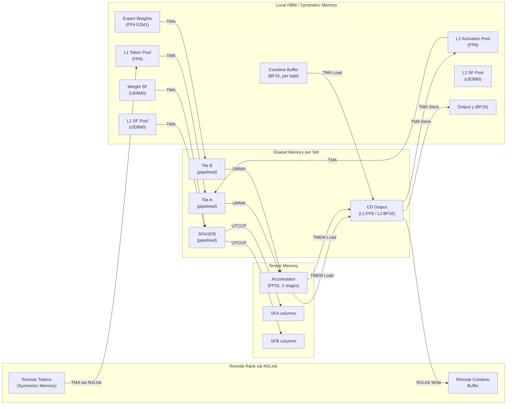

---

### 附录 A：编译与测试指南

#### A.1 环境要求

| 依赖 | 最低版本 | 推荐版本 | 说明 |
|------|---------|---------|------|
| GPU | SM90 (Hopper) / SM100 (Blackwell) | **SM100** | Mega MoE 仅支持 SM100 |
| CUDA Toolkit | 12.3 (SM90) / 12.9 (SM100) | **12.9+** | SM100 的 tcgen05/UMMA 需要 12.9+ |
| PyTorch | 2.1+ | **2.9+** | Mega MoE 需要 `torch.distributed._symmetric_memory` (PyTorch 2.9+) |
| Python | 3.8+ | 3.10+ | — |
| C++ 标准 | C++17 (编译扩展) | C++20 (JIT kernel) | JIT 编译器默认使用 C++20 |
| CUTLASS | 4.0+ | 通过 git submodule 获取 | `third-party/cutlass/` |
| {fmt} | — | 通过 git submodule 获取 | `third-party/fmt/` |
| NVLink | — | NVLink5 (B200) | Mega MoE 跨 GPU 通信 |

**Mega MoE 额外依赖（对比 baseline）：**

| 依赖 | 用途 |
|------|------|
| `deep_ep` | Baseline 对照的 EP dispatch/combine（可选，仅用于正确性验证和 baseline benchmark） |
| `tilelang` + `tilelang_ops` | Baseline 的 SwiGLU 实现（可选，同上） |

#### A.2 编译安装

**方式一：开发模式（推荐调试）**

```bash
# 克隆仓库（必须递归拉取 submodule）
git clone --recursive git@github.com:deepseek-ai/DeepGEMM.git
cd DeepGEMM

# 切换到 PR #304 分支（如果尚未合并）
gh pr checkout 304

# 构建 JIT CPP 模块（生成 .so 并 symlink 到 deep_gemm/）
./develop.sh
```

`develop.sh` 的核心操作：
1. 将 CUTLASS/CuTe 的 include 目录软链接到 `deep_gemm/include/`
2. 通过 `python setup.py build` 编译 C++ 扩展（`deep_gemm._C`）
3. 将生成的 `.so` 文件软链接回 `deep_gemm/` 目录

**方式二：Wheel 安装**

```bash
./install.sh
# 等价于：python setup.py bdist_wheel && pip install dist/*.whl --force-reinstall
```

**环境变量控制编译行为：**

| 变量 | 值 | 说明 |
|------|------|------|
| `DG_SKIP_CUDA_BUILD` | `1` | 跳过 CUDA 编译（仅生成 sdist） |
| `DG_FORCE_BUILD` | `1` | 强制本地编译（不尝试下载预编译 wheel） |
| `DG_USE_LOCAL_VERSION` | `1`（默认） | 版本号带 git hash 后缀 |
| `DG_JIT_USE_RUNTIME_API` | `1` | 使用 CUDA Runtime API 加载 kernel（需 CUDA ≥ 12.8） |

#### A.3 运行现有测试

```bash
# 基础测试（单 GPU）
python tests/test_layout.py          # 布局测试
python tests/test_fp8_fp4.py         # FP8×FP4 GEMM 测试（需要 SM100）
python tests/test_bf16.py            # BF16 GEMM 测试
python tests/test_attention.py       # MQA Logits 测试
python tests/test_einsum.py          # Einsum 测试
python tests/test_hyperconnection.py # HyperConnection 测试

# 正确性 sanitizer（单 GPU，启用 CUDA_LAUNCH_BLOCKING）
python tests/test_sanitizer.py

# 多 GPU lazy init 测试（需要 8 GPU）
python tests/test_lazy_init.py
```

**注意：** 所有测试文件是独立脚本（非 pytest），直接 `python` 执行即可。内部通过 `bench_kineto` 做性能基准测试并打印 TFLOPS/GB/s。

#### A.4 运行 Mega MoE 测试

Mega MoE 测试需要**多 GPU 分布式环境**（默认 8 GPU）。

**基本用法：**

```bash
# 默认配置（8 GPU, DeepSeek V3 参数）
python tests/test_mega_moe.py

# 自定义参数
python tests/test_mega_moe.py \
    --num-processes 8 \
    --num-max-tokens-per-rank 8192 \
    --num-tokens 1024 \
    --hidden 7168 \
    --intermediate-hidden 3072 \
    --num-experts 384 \
    --num-topk 6 \
    --activation-clamp 10 \
    --fast-math 1
```

**命令行参数一览：**

| 参数 | 默认值 | 说明 |
|------|--------|------|
| `--num-processes` | 8 | 启动的 GPU 进程数 |
| `--num-max-tokens-per-rank` | 8192 | 每 rank 最大 token 数（决定 symmetric buffer 大小） |
| `--num-tokens` | 0 | 实际 token 数（0 = max - random removed） |
| `--num-max-removed-tokens` | 0 | 随机移除的最大 token 数 |
| `--hidden` | 7168 | 隐藏维度 |
| `--intermediate-hidden` | 3072 | FFN 中间维度 |
| `--num-experts` | 384 | Expert 总数 |
| `--num-topk` | 6 | Top-K 选择数 |
| `--activation-clamp` | 10 | SwiGLU activation clamp 值 |
| `--fast-math` | 1 | 启用快速数学（`__expf` + `fast_rcp`） |
| `--masked-ratio` | 0.0 | 随机 mask 部分 expert 选择（模拟 padding） |
| `--num-correctness-tests` | None | 正确性压力测试轮数（需要 `deep_ep` + `tilelang`） |
| `--dump-profile-traces` | "" | 导出 Kineto profiling trace 的目录 |
| `--local-rank-idx` | None | 单进程模式（用于 NCU profiling） |

**正确性测试（需要 baseline 依赖）：**

```bash
# 安装 baseline 依赖
pip install deep_ep tilelang

# 运行 100 轮正确性压力测试（bitwise exact 验证）
python tests/test_mega_moe.py --num-correctness-tests 100
```

正确性测试使用 `torch.equal()` 做 **bitwise 精确匹配**（不是近似比较），对比融合 kernel 与分离 baseline（DeepEP dispatch + FP8×FP4 GEMM + tilelang SwiGLU + FP8×FP4 GEMM + DeepEP combine）。

**性能 Profiling：**

```bash
# 导出 Kineto trace（每 rank 一个 JSON）
python tests/test_mega_moe.py --dump-profile-traces ./traces/

# 用 NCU 单进程 profiling（需要分别在每个 rank 上启动）
ncu --target-processes all \
    python tests/test_mega_moe.py --local-rank-idx 0 --num-processes 8
```

**输出示例：**

```
Config:
 > Tokens: 8192/8192
 > Hidden: 7168
 > Intermediate: 3072
 > Experts: 6/384
 > Buffer: 5.234 GiB

Performance:
 > EP:  0/ 8 | 1847 TFLOPS | overlap: 2103 TFLOPS, HBM 2834 GB/s, NVL 287 GB/s |  389 us, reduction:  15.2 us | 1.45x legacy
 > EP:  1/ 8 | 1823 TFLOPS | overlap: 2076 TFLOPS, HBM 2798 GB/s, NVL 283 GB/s |  394 us, reduction:  15.2 us | 1.43x legacy
 ...
```

输出字段说明：

| 字段 | 含义 |
|------|------|
| `TFLOPS` | 端到端 TFLOPS（含 dispatch/combine） |
| `overlap: TFLOPS` | 去除 combine 串行 reduce 后的等效 TFLOPS |
| `HBM GB/s` | 去除 reduce 后的 HBM 吞吐 |
| `NVL GB/s` | NVLink 吞吐 |
| `reduction` | Combine reduce 的估算串行时间 |
| `x legacy` | 相对 baseline（DeepEP+GEMM+SwiGLU+GEMM+DeepEP）的加速比 |

#### A.5 JIT 调试环境变量

| 变量 | 值 | 说明 |
|------|------|------|
| `DG_JIT_DEBUG` | `1` | 打印 JIT 调试信息（kernel 名、shape、grid 等） |
| `DG_PRINT_CONFIGS` | `1` | 打印每个 shape 选择的配置 |
| `DG_JIT_PTXAS_VERBOSE` | `1` | 显示 PTXAS 详细输出（寄存器、smem 使用） |
| `DG_JIT_PTXAS_CHECK` | `1` | 检查编译后是否有 local memory spill |
| `DG_JIT_PRINT_COMPILER_COMMAND` | `1` | 打印 NVCC 编译命令 |
| `DG_JIT_PRINT_LOAD_TIME` | `1` | 打印 kernel 加载时间 |
| `DG_JIT_DUMP_PTX` | `1` | 导出 PTX 中间表示 |
| `DG_JIT_DUMP_SASS` | `1` | 导出 SASS 汇编 |
| `DG_JIT_DUMP_ASM` | `1` | 导出汇编 |
| `DG_JIT_WITH_LINEINFO` | `1` | 嵌入行号信息（供 NCU source mapping） |
| `DG_COMM_KERNEL_DEBUG` | `1` | Mega MoE 每次调用前清零 symmetric buffer（调试用） |
| `DG_USE_NVIDIA_TOOLS` | `1` | 外部 NVIDIA 工具运行时跳过内部 profiling |

**调试示例：**

```bash
# 查看 Mega MoE 的 kernel 配置选择
DG_PRINT_CONFIGS=1 python tests/test_mega_moe.py --num-tokens 1024

# 检查是否有寄存器 spill（local memory 使用）
DG_JIT_PTXAS_CHECK=1 DG_JIT_PTXAS_VERBOSE=1 python tests/test_mega_moe.py

# 导出 SASS 用于手动分析指令调度
DG_JIT_DUMP_SASS=1 python tests/test_mega_moe.py
```

---

### 附录 B：Python 使用示例

```python
import torch
import torch.distributed as dist
import deep_gemm

# 1. 初始化分布式环境
group = dist.init_process_group(...)

# 2. 分配 symmetric memory buffer
buffer = deep_gemm.get_symm_buffer_for_mega_moe(
    group, num_experts=384,
    num_max_tokens_per_rank=8192, num_topk=6,
    hidden=7168, intermediate_hidden=3072
)

# 3. 准备权重 (FP4 with UE8M0 SF)
transformed_l1, transformed_l2 = deep_gemm.transform_weights_for_mega_moe(
    l1_weights, l2_weights  # Tuple[Tensor, Tensor] for (data, sf)
)

# 4. 每次推理前拷贝输入到 buffer
buffer.x[:num_tokens].copy_(x_fp8)
buffer.x_sf[:num_tokens].copy_(x_sf)
buffer.topk_idx[:num_tokens].copy_(topk_idx)
buffer.topk_weights[:num_tokens].copy_(topk_weights)

# 5. 执行融合 mega MoE kernel
y = torch.empty((num_tokens, 7168), dtype=torch.bfloat16, device='cuda')
deep_gemm.fp8_fp4_mega_moe(
    y, transformed_l1, transformed_l2, buffer,
    activation_clamp=10.0, fast_math=True
)
```


---

# 第二章：Warp 级计算流程深度分析

> 基于 PR #304 源码 `sm100_fp8_fp4_mega_moe.cuh` 的逐指令级分析
> GPU: NVIDIA B200 (SM100), 148 SMs, 2-CTA Cluster

### 1. Block 与 Warp 总览

#### 1.1 Launch 配置

| 参数 | 值 | 说明 |
|------|-----|------|
| Grid | (148, 1, 1) | 每个 SM 恰好 1 个 Block (persistent kernel) |
| Block | (512, 1, 1) | 16 个 Warp |
| Cluster | 2 CTA | 相邻 2 个 SM 组成 1 个 Cluster (共享 TMEM) |
| Registers/Thread | 128 | 动态调整，非均匀分配 |
| Shared Memory | 229,668 bytes (224.3 KB) | 98.8% of max 232,448 bytes |
| `__launch_bounds__` | (512, 1) | 最多 1 block/SM |

#### 1.2 线程分配：128 + 128 + 256 = 512

```
kNumDispatchThreads  = 128  →  4 warps  (Warp 0-3)
kNumNonEpilogueThreads = 128 →  4 warps  (Warp 4-7)
kNumEpilogueThreads  = 256  →  8 warps  (Warp 8-15)
```

#### 1.3 Warp 角色分配表

```
┌──────────┬──────────────────────┬─────────────┬────────────────────────────────┐
│ Warp ID  │ 角色                 │ 寄存器/线程 │ 主要职责                       │
├──────────┼──────────────────────┼─────────────┼────────────────────────────────┤
│  0       │ Dispatch Leader      │ 48          │ SMEM 清零 + token dispatch      │
│  1       │ Dispatch             │ 48          │ mbarrier 初始化 + dispatch      │
│  2       │ Dispatch             │ 48          │ GEMM barrier 初始化 + dispatch  │
│  3       │ Dispatch             │ 48          │ TMEM 分配 + token dispatch      │
├──────────┼──────────────────────┼─────────────┼────────────────────────────────┤
│  4       │ TMA Warp A           │ 40          │ TMA 加载 Activations + SFA     │
│  5       │ TMA Warp B           │ 40          │ TMA 加载 Weights + SFB         │
│  6       │ MMA Warp             │ 40          │ UMMA 发射 (仅 leader CTA)      │
│  7       │ Reserved             │ 40          │ 空闲 (仅做寄存器释放)           │
├──────────┼──────────────────────┼─────────────┼────────────────────────────────┤
│  8-11    │ Epilogue WG0         │ 208         │ SwiGLU/FP8/BF16 + TMA store   │
│ 12-15    │ Epilogue WG1         │ 208         │ SwiGLU/FP8/BF16 + TMA store   │
└──────────┴──────────────────────┴─────────────┴────────────────────────────────┘
```

#### 1.4 寄存器预算

```
Dispatch:    48 × 128 =  6,144
NonEpilogue: 40 × 128 =  5,120
Epilogue:   208 × 256 = 53,248
─────────────────────────────
Total:                  64,512 / 65,536 (98.4%)
```

---

### 2. 初始化阶段 (所有 Warp 参与)

进入 kernel 后，前 4 个 warp 各负责一项初始化任务：

```
Timeline:  ←───── cluster_sync() ─────→  ←───── cluster_sync() ─────→
           
Warp 0: [ st_shared_bulk: 清零 expert_count SMEM ]
Warp 1: [ init dispatch mbarriers × kNumDispatchWarps ]
Warp 2: [ init GEMM full/empty barriers, TMEM full/empty barriers, combine barriers ]
Warp 3: [ TMEM Allocator: allocate kNumTmemCols 列 tensor memory ]
```

**关键同步**: 两次 `cluster_sync()` — 第一次保证 2-CTA 集群就绪，第二次保证所有初始化完成。

---

### 3. Phase 1: Expert Dispatch (Warp 0-3)

**4 个 Dispatch warp 协作完成跨 rank 的 token 路由与数据搬运**。

#### 3.1 Step 1: Expert 计数 (~6.5 us)

```
每个 warp 处理 kNumTokensPerWarp = 32/kNumTopk = 8 个 token
遍历 token → 读 topk_idx → atomicAdd_block(smem_expert_count)
  ↓
sync_aligned(128, kDispatchBarrierIdx)  // 4 warp barrier
  ↓
每个线程对 kNumExperts 做 atomic_add 到 workspace 获取全局 SM offset
  ↓
sync_aligned(128, kDispatchBarrierIdx)
```

#### 3.2 Step 2: 写入源索引 (NVLink remote write)

```
再次遍历 token-topk 对:
  计算 dst_rank_idx = expert_idx / kNumExpertsPerRank
  atomicAdd_block 获取 slot
  通过 sym_buffer.map() 写入远端 rank 的 src_token_topk_idx
    ↑ 这是 NVLink 远程写入 (symmetric memory)
```

#### 3.3 Step 3: Grid Sync + NVLink Barrier

```
grid_sync: 148 SM 全部到达同步点
  ↓
SM 0 将 expert_count 写入各远端 rank
  ↓
nvlink_barrier (kBeforeDispatchPullBarrierTag):
  - grid_sync (可选前置)
  - SM 0: red_add_rel_sys 信号到所有 peer rank
  - SM 0: 自旋等待所有 rank signal 到达
  - grid_sync (后置)
```

#### 3.4 Step 4: Token Pull (主循环, 最耗时)

```
for token_idx = (sm_idx * 4 + warp_idx) ;; token_idx += 148 * 4:
    ├─ 确定当前 expert_idx 和 token_idx_in_expert
    ├─ Round-robin rank selection (reduce_min + reduce_add within warp)
    ├─ 读 src_token_topk_idx (已被远端 dispatch 写入)
    │
    ├─ [elect_one] TMA load 1D: 远端 rank → pull_buffer (SMEM)
    │     src: sym_buffer.map(input_token_buffer, remote_rank)
    │     size: kHidden bytes (7168 × FP8 = 7168 bytes)
    │
    ├─ [全 lane] 并行加载 SF (kHidden/128 个 uint32) 从远端 → 本地 l1_sf_buffer
    │
    ├─ [elect_one] 等待 TMA 完成:
    │     mbarrier_arrive_and_set_tx → mbarrier_wait_and_flip_phase
    │
    ├─ [elect_one] TMA store 1D: pull_buffer → l1_token_buffer (HBM)
    │     然后 tma_store_arrive + tma_store_wait
    │
    ├─ [elect_one] 写入 token_src_metadata (rank, token_idx, topk_idx)
    │
    └─ [elect_one] red_add_rel(l1_arrival_count) ← 通知 TMA Warp A 数据就绪
```

**每个 token 的 dispatch pull 链路:**
```
Remote Rank HBM → (NVLink) → SMEM pull_buffer → (TMA) → Local HBM l1_token_buffer
```

#### 3.5 Step 5: 清理 + 结束 Barrier

```
sync_unaligned(128+256, kDispatchWithEpilogueBarrierIdx)  // 与 Epilogue 同步
  ↓
SM 0: 清零 expert_send_count
SM 1-147: 清零各 expert 的 recv_count, l1/l2 arrival
  ↓
nvlink_barrier (kAfterWorkspaceCleanBarrierTag): 所有 rank 清理完成
```

---

### 4. Phase 2: GEMM 计算 (Warp 4-7)

**这是 GEMM 的核心流水线，3 个 warp 协作，1 个 warp 空闲。**

#### 4.1 流水线结构 (Multi-Stage Pipeline)

```
kNumStages = 6 (TMA/GEMM 流水线深度)
kNumEpilogueStages 阶段 (TMEM accumulator 流水线)
```

#### 4.2 Warp 4 (TMA Warp A): 加载 Activations + Scale Factor A

```
scheduler.for_each_block([&](block_phase, expert_idx, num_k_blocks, m_block_idx, n_block_idx) {
    
    // 选择 TMA descriptor (L1 vs L2 阶段)
    tensor_map_ptr = (Linear2 ? tensor_map_l2_acts : tensor_map_l1_acts)
    
    // Linear1: 等待 dispatch pull 完成
    if (Linear1) {
        while (ld_acq(l1_arrival_count) != expected_tokens);  // 自旋等待
    }
    
    // K 维度循环 (6 个 K block)
    for k_block_idx = 0 .. num_k_blocks:
        // Linear2: 等待 L1 output 的对应 K block 就绪
        if (Linear2) {
            while (cached_l2_arrival_mask & needed_bits != needed_bits):
                cached = ld_acq_gpu(l2_arrival_mask)
        }
        
        // 等待上一轮 consumer (MMA) 释放 SMEM 空间
        empty_barriers[stage].wait(phase ^ 1)
        
        // [elect_one] 发射 2 个 TMA copy:
        //   1. tma::copy A tile: [BLOCK_K × LOAD_BLOCK_M] → smem_a[stage]
        //   2. tma::copy SFA:    [SF_BLOCK_M × 1]         → smem_sfa[stage]
        //   到 2 个 CTA (multicast arrive)
        
        advance_pipeline(k_block_idx)  // stage_idx 轮转, phase 翻转
});
```

#### 4.3 Warp 5 (TMA Warp B): 加载 Weights + Scale Factor B

```
scheduler.for_each_block([&](...) {
    for k_block_idx = 0 .. num_k_blocks:
        empty_barriers[stage].wait(phase ^ 1)
        
        // [elect_one] 发射 2 个 TMA copy:
        //   1. tma::copy B tile: [BLOCK_K × LOAD_BLOCK_N] → smem_b[stage]
        //   2. tma::copy SFB:    [BLOCK_N × 1]            → smem_sfb[stage]
        //   arrive at 2 CTAs
        
        advance_pipeline(k_block_idx)
});
```

#### 4.4 Warp 6 (MMA Warp): UMMA 发射 (仅 Leader CTA)

**这是整个 kernel 的计算核心。只有 cluster 的 leader CTA 上的这个 warp 发射 UMMA 指令。**

```
// 构建 UMMA instruction descriptor (block-scaled FP8×FP4)
instr_desc = UMMA::make_instr_desc_block_scaled<FP4, FP8, FP32, UE8M0>()

scheduler.for_each_block([&](...) {
    // 动态更新 UMMA N 维度 (基于有效 M)
    update_instr_desc_with_umma_n(instr_desc, valid_m)
    
    // 等待 TMEM accumulator 空闲
    tmem_empty_barriers[accum_stage].wait(accum_phase ^ 1)
    tcgen05_after_thread_sync()
    
    // K 维度循环 (#pragma unroll 2)
    for k_block_idx = 0 .. num_k_blocks:
        // 等待 TMA 加载完成 (A 和 B 都到达)
        full_barriers[stage].wait(phase)
        tcgen05_after_thread_sync()
        
        // [elect_one] UTCCP: 从 SMEM 复制 Scale Factor 到 TMEM
        //   SFA: SF_BLOCK_M 个元素 → TMEM kTmemStartColOfSFA
        //   SFB: SF_BLOCK_N 个元素 → TMEM kTmemStartColOfSFB
        //   使用 SM100_UTCCP_4x32dp128bit_2cta 指令
        
        // [elect_one] 发射 UMMA (BLOCK_K / UMMA_K 次)
        for k = 0 .. BLOCK_K/UMMA_K:
            // 计算运行时指令描述符 (含 SF ID)
            runtime_instr_desc = make_runtime_instr_desc_with_sf_id(k, k)
            
            // 更新 A/B SMEM descriptor 的 K 偏移
            a_desc.lo = advance_umma_desc_lo(a_desc_base, 0, k * UMMA_K)
            b_desc.lo = advance_umma_desc_lo(b_desc_base, 0, k * UMMA_K)
            
            // ★ 核心: 发射 FP8×FP4 Block-Scaled MMA ★
            SM100_MMA_MXF8F6F4_2x1SM_SS::fma(
                b_desc, a_desc,                  // SMEM→SMEM 操作数
                accum_stage * UMMA_N,            // TMEM accumulator 偏移
                k_block_idx > 0 or k > 0,       // 是否累加 (第一个 K block 的第一个 sub-block 初始化)
                runtime_instr_desc,              // 指令描述
                kTmemStartColOfSFB,              // B 的 scale factor 在 TMEM 的列
                kTmemStartColOfSFA               // A 的 scale factor 在 TMEM 的列
            )
        
        // commit: umma_arrive_multicast_2x1SM → empty/tmem_full barriers
        empty_barrier_arrive(is_last_k_block)
});
```

**UMMA 数据流:**

```
SMEM_A[stage] ─┐
               ├─→ UMMA MXF8F6F4 ─→ TMEM Accumulator (FP32)
SMEM_B[stage] ─┘         ↑
                    TMEM SFA/SFB (UE8M0 scale)
```

#### 4.5 Warp 7 (Reserved)

```
// 仅执行寄存器释放，不做任何计算
warpgroup_reg_dealloc<40>()
// 然后空转直到 kernel 结束
```

---

### 5. Phase 3: Epilogue (Warp 8-15)

**8 个 Epilogue warp 分为 2 个 Warp Group (WG0: 8-11, WG1: 12-15)**

#### 5.1 Warp Group 内部分工

```
WG0 (Warp 8-11):  处理 BLOCK_M 的上半部分 (row 0 ~ BLOCK_M/2 - 1)
WG1 (Warp 12-15): 处理 BLOCK_M 的下半部分 (row BLOCK_M/2 ~ BLOCK_M - 1)

每个 WG 内:
  4 warps 分别处理 BLOCK_N/4 = 32 列
```

#### 5.2 Linear1 Epilogue: SwiGLU + FP8 量化 + TMA Store

```
scheduler.for_each_block([&](...) {
    // 等待 UMMA 完成写入 TMEM
    tmem_full_barriers[accum_stage].wait(accum_phase)
    
    if (Linear1):
        for s = 0 .. WG_BLOCK_M / STORE_BLOCK_M:  // 每 STORE_BLOCK_M 行一轮
            for i = 0 .. kNumAtomsPerStore:  // 每 ATOM_M=8 行一个 atom
                
                // ① 从 global 加载 routing weight (per 32 tokens, 寄存器缓存)
                cached_weight = l1_topk_weights_buffer[token_idx]
                weight = exchange(cached_weight, ...)  // warp shuffle 分发
                
                // ② 从 TMEM 加载 UMMA 结果 (FP32 accumulator)
                SM100_TMEM_LOAD_16dp256b1x::copy(tmem_addr, values[0..3])
                SM100_TMEM_LOAD_16dp256b1x::copy(tmem_addr | 0x100000, values[4..7])
                fence_view_async_tmem_load()
                
                // ③ 释放 TMEM (最后一个 atom 时)
                if (last_atom):
                    tcgen05_before_thread_sync()
                    tmem_empty_barriers[accum_stage].arrive()
                
                // ④ SwiGLU 计算 (gate/up pairs from TMEM layout)
                //    Gate/Up pairs: (val[0],val[2]), (val[1],val[3]), (val[4],val[6]), (val[5],val[7])
                for k = 0..1:
                    bf16_gate = float22bfloat162(fp32_values[k*4], fp32_values[k*4+1])
                    bf16_up   = float22bfloat162(fp32_values[k*4+2], fp32_values[k*4+3])
                    
                    // Clamp (可选)
                    gate = clamp(gate, -kActivationClamp, kActivationClamp)
                    up   = clamp(up,   -kActivationClamp, kActivationClamp)
                    
                    // SiLU(gate): gate * sigmoid(gate)
                    neg_exp = expf(-gate)
                    denom = 1.0 + neg_exp
                    silu_gate = gate * fast_rcp(denom)  // or gate / denom
                    
                    // SwiGLU = silu(gate) × up × routing_weight
                    result = silu_gate * up * weight
                
                // ⑤ Amax 归约 (4 lane 内 reduce_max, 跨 warp pair 通过 SMEM)
                amax = warp_reduce<4>(max(abs(values)))
                smem_amax_reduction[...] = amax
            
            // ⑥ 等待上一轮 TMA store 完成
            tma_store_wait<kNumTMAStoreStages - 1>()
            sync_aligned(128, kEpilogueWGBarrierStartIdx + wg_idx)
            
            // ⑦ 跨 warp pair 合并 amax → 计算 FP8 scale → 量化
            for each atom:
                cross_warp_amax = max(my_amax, other_warp_amax)
                sf, sf_inv = get_e4m3_sf_and_sf_inv(cross_warp_amax)
                fp8_values = fp8_e4m3(swiglu_result * sf_inv)
                
                // STSM: 写入 SMEM (swizzle layout)
                SM100_U8x4_STSM_T::copy(fp8_values, smem_cd[tma_stage])
                
                // 写 SF 到 l2_sf_buffer (UE8M0 格式, MN-major)
                if (warp_idx % 2 == 0 and lane < 4):
                    l2_sf_buffer[...] = uint8_t(sf >> 23)
            
            sync_aligned(128, ...)  // WG 内同步
            
            // ⑧ TMA Store: SMEM → L1 output (HBM)
            if (warp 0 in WG, elect_one):
                tma_store_fence()
                SM90_TMA_STORE_2D(smem_cd → tensor_map_l1_output)
                tma_store_arrive()
        
        // ⑨ 通知 L2 阶段: l2_arrival_mask |= (1 << n_block_idx)
        if (warp 0 in epilogue, elect_one):
            red_or_rel_gpu(l2_arrival_mask, 1 << n_block_idx)
```

#### 5.3 Linear2 Epilogue: BF16 + NVLink 远程写入

```
    else (Linear2):
        for s = 0 .. WG_BLOCK_M / STORE_BLOCK_M:
            for i = 0 .. STORE_BLOCK_M / ATOM_M:
                
                // ① TMEM → registers (FP32)
                SM100_TMEM_LOAD_16dp256b1x::copy(...)
                
                // ② 释放 TMEM (最后一个 atom)
                if (last):
                    tmem_empty_barriers.arrive()
                
                // ③ FP32 → BF16 pack + STSM → SMEM (swizzle BF16 layout)
                packed = cast_into_bf16_and_pack(val[0], val[1])
                SM90_U32x4_STSM_T::copy(packed, smem_cd_l2)
            
            // ④ WG 内同步 (SMEM ready)
            sync_aligned(128, ...)
            
            // ⑤ NVLink 远程写入 (每 warp 处理多行)
            for j = 0 .. kNumRowsPerWarp:
                src_metadata = workspace.get_token_src_metadata(token)
                dst_rank = src_metadata.rank_idx
                dst_token = src_metadata.token_idx
                dst_topk = src_metadata.topk_idx
                
                // 从 SMEM 读 BF16
                packed = ld_shared<float4>(smem_cd_l2 + ...)
                
                // ★ NVLink 写入远端 combine buffer ★
                dst_ptr = combine_token_buffer[topk][token]
                *sym_buffer.map(dst_ptr, dst_rank) = packed
```

#### 5.4 NVLink Barrier + Combine

```
// ═══ Phase 转换: NVLink Barrier (所有 rank GEMM 完成) ═══
nvlink_barrier(kBeforeCombineReduceBarrierTag)
  ↓
sync_unaligned(dispatch + epilogue)  // 让 dispatch warp 开始清理

// ═══ Combine: 归约所有 top-k 贡献 ═══
// 每个 epilogue warp 独立处理不同 token
for token_idx = (sm_idx * 8 + epilogue_warp_idx) ;; token_idx += 148 * 8:
    
    // 读取该 token 的 top-k slot indices
    stored_topk_slot_idx = ldg(topk_idx[token * kNumTopk + lane])
    
    for chunk = 0 .. kNumChunks:  // hidden 可能分 1-2 块处理
        
        // Double-buffered TMA load + accumulate
        float2 reduced[...] = {0}
        load stage 0: TMA load 1D from combine_token_buffer[slot][token]
        
        while (has_more_topk):
            // Prefetch next topk into stage 1
            load stage 1: TMA load 1D from next combine_token_buffer
            
            // Accumulate current stage
            wait(combine_load_barriers[stage])
            for each uint4 element:
                bf16_pair = reinterpret_cast<bfloat162*>(loaded)
                ptx::accumulate(reduced, bf16_pair)  // FP32 累加
            
            swap stages
        
        // BF16 cast + TMA store → output y
        casted_bf16 = float22bfloat162(reduced)
        st_shared(combine_store_buffer, casted)
        tma_store_1d(y[token * kHidden + chunk_offset], store_buffer, kNumChunkBytes)
```

---

### 6. 完整时间线 (Warp-Level Timeline)

以一个完整的 Expert 处理为例 (1 个 L1 GEMM + 1 个 L2 GEMM):

```
Time →
═══════════════════════════════════════════════════════════════════════════════

Warp 0-3 (Dispatch):
  ├─ [Count tokens]─[Grid sync]─[NVLink barrier]─────────────────────────────
  ├─ [TMA pull token 0]─[TMA pull token 1]─...─[TMA pull token N]───────────
  │   每个: NVLink read → SMEM → TMA store → red_add(arrival_count)
  └─ ...等待 epilogue 完成后做 workspace cleanup...

Warp 4 (TMA-A):
  │ (spin-wait: l1_arrival_count == expected)
  ├─ [empty.wait]─[TMA A k=0]─[empty.wait]─[TMA A k=1]─...─[TMA A k=5]───
  │  L1 GEMM (6 K blocks)
  ├─ [mask.wait]─[empty.wait]─[TMA A k=0]─...─[TMA A k=5]─────────────────
  │  L2 GEMM (6 K blocks, wait l2_arrival_mask)
  └─ → next expert block

Warp 5 (TMA-B):
  ├─ [empty.wait]─[TMA B k=0]─[empty.wait]─[TMA B k=1]─...─[TMA B k=5]───
  ├─ [empty.wait]─[TMA B k=0]─...─[TMA B k=5]─────────────────────────────
  └─ → next expert block

Warp 6 (MMA, leader CTA only):
  ├─ [tmem_empty.wait]─────────────────────────────────────────────────────
  ├─ [full.wait]─[UTCCP SF→TMEM]─[UMMA k0]─[UMMA k1]─...─[UMMA kN]──────
  │   每个 UMMA: SM100_MMA_MXF8F6F4_2x1SM_SS::fma (BLOCK_K/UMMA_K 次)
  ├─ [arrive empty+tmem_full]──────────────────────────────────────────────
  ├─ [full.wait]─[UTCCP]─[UMMA...]─[arrive]  ... (L2 GEMM)
  └─ → next expert block

Warp 7 (Reserved):
  └─ zzz (idle)

Warp 8-11 (Epilogue WG0, rows 0~63):
  ├─ [tmem_full.wait]─────────────────────────────────────────────────────
  ├─ [TMEM load → SwiGLU → Amax → FP8 cast → STSM → TMA store]  L1 epilogue
  ├─ [red_or(l2_mask)]────────────────────────────────────────────────────
  ├─ [tmem_full.wait]─────────────────────────────────────────────────────
  ├─ [TMEM load → BF16 cast → STSM → NVLink write]  L2 epilogue
  └─ → next expert block

Warp 12-15 (Epilogue WG1, rows 64~127):
  ├─ (同 WG0, 处理下半部分 M 行)
  └─ → next expert block

═══════════════════════════════════════════════════════════════════════════════
After all experts:

Warp 8-15:
  ├─ [NVLink barrier: 所有 rank GEMM 完成]──────────────────────────────────
  ├─ [sync with dispatch: 允许 cleanup 开始]─────────────────────────────────
  ├─ [Combine: TMA load topk → accumulate → BF16 → TMA store → output y]──
  └─ done

Warp 0-3:
  ├─ [cleanup: 清零 expert count / arrival / mask]──────────────────────────
  ├─ [NVLink barrier: 所有 rank cleanup 完成]────────────────────────────────
  └─ done
```

---

### 7. 关键同步机制总结

#### 7.1 Barrier 类型

| Barrier 名称 | 类型 | 生产者 → 消费者 | 作用 |
|-------------|------|----------------|------|
| `dispatch_barriers[i]` | mbarrier | TMA pull → self | 单 warp TMA pull 完成通知 |
| `full_barriers[stage]` | ClusterTransactionBarrier | TMA Warp A/B → MMA Warp | SMEM 中 A/B tile 就绪 |
| `empty_barriers[stage]` | ClusterTransactionBarrier | MMA Warp → TMA Warp A/B | MMA 消费完毕可覆写 |
| `tmem_full_barriers[stage]` | mbarrier | MMA Warp → Epilogue | TMEM accumulator 就绪 |
| `tmem_empty_barriers[stage]` | mbarrier | Epilogue → MMA Warp | TMEM 已读取可覆写 |
| `combine_barriers[i]` | mbarrier | TMA load → self | combine 的 TMA 完成 |
| `l1_arrival_count` | atomic counter | Dispatch → TMA-A | 所有 token 已 pull 到位 |
| `l2_arrival_mask` | atomic bitmask | Epilogue → TMA-A | L1 output 的 N block 就绪 |

#### 7.2 全局同步

| 同步类型 | 函数 | 范围 |
|---------|------|------|
| Block 内 warp 组同步 | `sync_aligned(N, idx)` | N 线程 |
| 跨 warp 组同步 | `sync_unaligned(N, idx)` | dispatch + epilogue |
| Grid 同步 | `grid_sync<kNumSMs>()` | 所有 148 SM |
| 跨 rank 同步 | `nvlink_barrier<kNumRanks>()` | 8 GPU via NVLink |

---

### 8. 性能关键路径分析

#### 8.1 Compute-Bound 路径 (稳态)

```
TMA Load A/B → UMMA (Tensor Core) → TMEM Load → SwiGLU/Quantize → TMA Store
```

在稳态下，pipeline 深度 = 6 stages 保证 TMA 和 UMMA 可以完全重叠。

#### 8.2 Memory-Bound 路径

```
Dispatch: NVLink read (token data) → SMEM → TMA store to HBM
Combine:  TMA load (combine buffer) → register accumulate → TMA store to output
```

#### 8.3 关键瓶颈

1. **Dispatch Pull**: 每个 token 需要 1 次 NVLink read + 1 次 TMA store，受 NVLink 带宽限制
2. **L2 Epilogue NVLink Write**: 每 STORE_BLOCK_M 行做一次跨 rank BF16 写入
3. **Combine Reduce**: 每个 token 需要 kNumTopk 次 TMA load + FP32 累加
4. **NVLink Barriers**: 3 次跨 rank barrier (~4 us each)

#### 8.4 为什么 Warp 7 空闲？

SM100 的 2-CTA cluster UMMA 只需要 leader CTA 的 1 个 warp 发射指令。Warp 7 的 128 threads × 40 registers = 5,120 registers 留给了编译器的 spill headroom，且保持了 `kNumNonEpilogueThreads = 128` (4 warps) 的对齐要求。

---

### 9. 数据格式流转

```
输入层:
  Token Activation: FP8 E4M3  (7168 元素/token)
  Token Scale:      UE8M0     (7168/128 = 56 个 scale)
  
Linear1 权重:
  Weight: FP4 E2M1  (packed, 7168 × 6144)
  Scale:  UE8M0     (per-block 128 granularity)

UMMA 计算:
  A × B → TMEM (FP32 accumulator)
  
SwiGLU + 量化:
  FP32 → BF16 (clamp) → SiLU(gate) × up × weight → FP8 E4M3 (amax → scale)
  
Linear2 权重:
  Weight: FP4 E2M1  (packed, 3072 × 7168)
  Scale:  UE8M0

L2 Epilogue:
  FP32 → BF16 → NVLink write

Combine:
  BF16 (from all topk ranks) → FP32 accumulate → BF16 → TMA store
  
输出:
  BF16 (7168 元素/token)
```


---

# 第三章：设计原理与技术深度解析

> 解析 PR #304 `sm100_fp8_fp4_mega_moe_impl` 背后的设计决策、技术原理与优化机制

### 目录

1. [整体计算流程图（优化版）](#1-整体计算流程图优化版)
2. [Warp 专业化架构与流水线时序](#2-warp-专业化架构与流水线时序)
3. [核心设计决策 Q&A](#3-核心设计决策-qa)
4. [关键技术点深度解析](#4-关键技术点深度解析)
5. [与传统实现的对比](#5-与传统实现的对比)

---

### 1. 整体计算流程图（优化版）

#### 1.1 宏观数据流

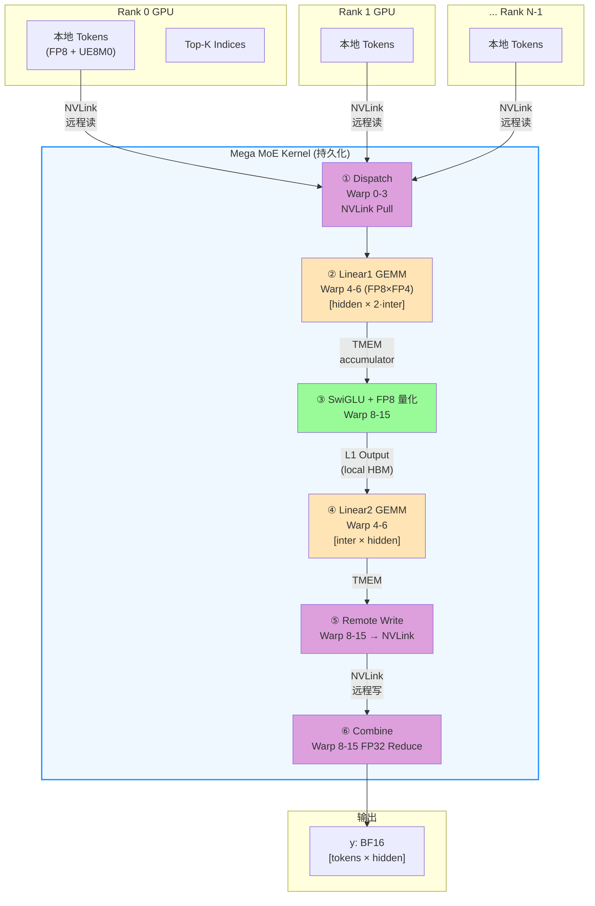

**关键特征**：6 个阶段全部在**同一个 CUDA kernel 内**完成，通过 NVLink symmetric memory 和 wave-based scheduler 实现 Dispatch/GEMM/Combine 的重叠。

#### 1.2 单个 SM 内的 Warp 角色协作（生产者-消费者模型）

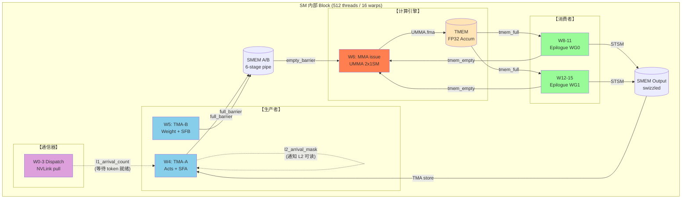

**要点**：
- 三方协作通过 **mbarrier / ClusterTransactionBarrier** 做细粒度 handshake
- **数据路径**全部走片上（SMEM → TMEM → SMEM），寄存器仅作中转
- Warp 7 为空闲槽位，留作未来扩展与寄存器对齐

#### 1.3 GEMM 流水线（6-stage 重叠）

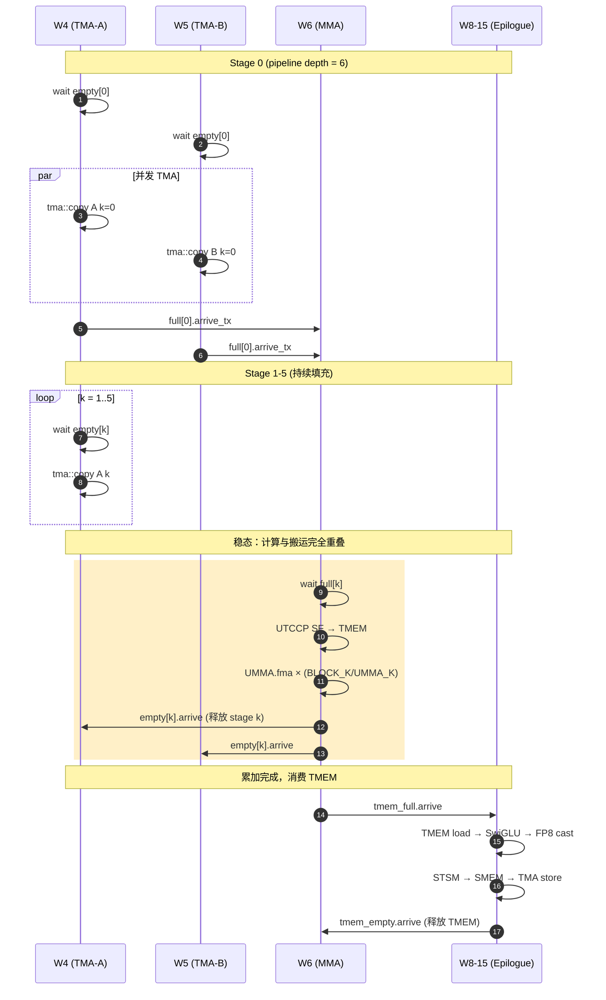

---

### 2. Warp 专业化架构与流水线时序

#### 2.1 为什么是 4 + 4 + 8 的非均匀分配？

```mermaid
graph TD
    subgraph Q1["决策 1: 为什么 Dispatch 要 4 warps?"]
        Q1A["Token pull 是<br/>每 token 独立"] -->
        Q1B["并行度 = 148 SM × 4 warps<br/>= 592 个 pull 通道"] -->
        Q1C["每 token 约 7KB<br/>NVLink 300+ GB/s<br/>→ 需足够并行隐藏延迟"]
    end

    subgraph Q2["决策 2: 为什么 NonEpilogue 只要 4 warps (3 个干活)?"]
        Q2A["UMMA 是单 warp 发射"] -->
        Q2B["TMA 也是单 warp 发射<br/>(elect_one)"] -->
        Q2C["只需 3 个工作 warp<br/>即可饱和流水线"]
    end

    subgraph Q3["决策 3: 为什么 Epilogue 要 8 warps?"]
        Q3A["BLOCK_M=128, BLOCK_N=128"] -->
        Q3B["2 WG × 4 warps<br/>= 8 warps"] -->
        Q3C["每 WG 处理 64 行<br/>每 warp 处理 32 列<br/>→ 天然对齐 TMEM layout"]
    end

    style Q1 fill:#e6f3ff
    style Q2 fill:#fff2e6
    style Q3 fill:#e6ffe6
```

#### 2.2 寄存器动态重分配原理

SM100 的 `warpgroup_reg_alloc/dealloc` PTX 指令允许运行时重新划分寄存器预算：

```
初始状态 (编译期分配):  每线程 128 regs  (Launch bounds 设定)
                          ↓
Kernel 入口后动态调整:

┌─────────────────┐        ┌─────────────────┐        ┌─────────────────┐
│ Dispatch warps  │        │ TMA/MMA warps   │        │ Epilogue warps  │
│ dealloc → 48    │        │ dealloc → 40    │        │ alloc → 208     │
│                 │        │                 │        │                 │
│ 够用：          │        │ 极简：          │        │ 大量 SwiGLU     │
│ - topk 索引     │        │ - 仅指令发射    │        │ - FP32 累加     │
│ - 循环变量      │        │ - 描述符常量    │        │ - amax/scale    │
│ - 4 warp 足够   │        │ - 无数据流      │        │ - 7168 维展开   │
└─────────────────┘        └─────────────────┘        └─────────────────┘

总和: 48×128 + 40×128 + 208×256 = 64,512 / 65,536 (98.4%)
```

**核心原理**：SM100 每 SM 只有 64K registers，平均分配只能给 128 regs/thread。但 Epilogue 的 SwiGLU 需要大量寄存器做 FP32 运算，而 TMA/MMA warp 只是指令发射几乎不用寄存器。**让需要的 warp 多占，不需要的让出** = 寄存器利用率最大化 = 更少的 register spill = 更高的 ILP。

#### 2.3 16 个 Warp 的完整时序

```mermaid
gantt
    title Warp 级别执行时间线（以 1 个 Expert 的 L1+L2 GEMM 为例）
    dateFormat X
    axisFormat %L

    section Dispatch W0-3
    Expert count          :d1, 0, 100
    NVLink barrier        :crit, d2, after d1, 50
    Token pull (N tokens) :d3, after d2, 600
    Workspace cleanup     :d4, after d3, 100

    section TMA-A W4
    Spin wait arrival     :t4a, after d3, 50
    L1 TMA A × 6          :t4b, after t4a, 300
    L2 wait mask          :t4c, after t4b, 30
    L2 TMA A × 6          :t4d, after t4c, 300

    section TMA-B W5
    L1 TMA B × 6          :t5a, 250, 300
    L2 TMA B × 6          :t5b, after t5a, 300

    section MMA W6
    L1 UMMA × 6 K blocks  :crit, m1, 280, 280
    L2 UMMA × 6 K blocks  :crit, m2, after m1, 280

    section Epilogue W8-15
    Wait TMEM full        :e1, after m1, 10
    SwiGLU + FP8 store    :e2, after e1, 150
    L2 BF16 NVLink write  :e3, after m2, 200
    Cross-rank barrier    :crit, e4, after e3, 50
    Combine reduce        :e5, after e4, 400
```

**观察**：
- Dispatch 与 GEMM **同步开始**，通过 `l1_arrival_count` 自旋等待实现细粒度重叠
- TMA-A 和 TMA-B **完全并发**，利用独立的 TMA 引擎
- MMA 和 Epilogue 在不同 K block 上**流水线重叠**（多 accumulator stage）
- Combine 段完全独立，不占用 GEMM 流水线资源

---

### 3. 核心设计决策 Q&A

#### Q1: 为什么要把 6 个阶段融合成 1 个 kernel？

| 维度 | 传统多 kernel | Mega MoE 融合 kernel |
|------|---------------|----------------------|
| Launch 次数 | 6+ 次 | 1 次 |
| Kernel 启动开销 | ~5-10 us × 6 = 30-60 us | ~5 us × 1 |
| 中间数据写回 HBM | 每阶段写回 + 下阶段读回 | TMEM / SMEM 直通 |
| 显存占用 | 需分配中间 buffer | 只需输入输出 |
| Dispatch / Combine NVLink 并发 | 串行 | 可与 GEMM 重叠 |
| 缓存命中率 | 每次 kernel 冷启动 L2 | 持久化复用 L2 |

**量化收益**（T=8192, H=7168, Intermediate=3072 × 6 experts × 8 ranks）：
- 启动开销省: ~40 us
- 中间 activation 省读写: ~2 × T × H × 2 bytes = 224 MB / 900 GB/s ≈ 250 us
- NVLink 重叠省: ~30% 通信被隐藏
- **总计：~500 us / 3100 us ≈ 16% 端到端加速**

#### Q2: 为什么采用 2-CTA Cluster？

SM100 引入了 **Thread Block Cluster**，允许多个 CTA 共享 Tensor Memory 并协同做 UMMA：

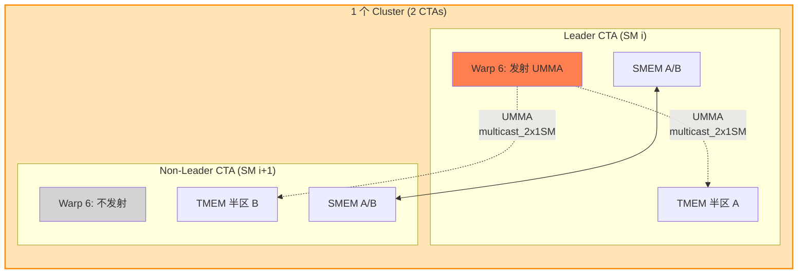

**好处**：
1. **单次 UMMA 指令做 2 个 CTA 的工作量** → 指令发射开销 / 2
2. **TMEM 容量翻倍** → BLOCK_N 可以做到 256
3. **SMEM 经由 `mem_dshared` 跨 CTA 共享** → 减少同一 tile 的重复加载
4. `arrive_multicast_2x1SM` 一次通知两个 CTA → 同步效率更高

**代价**：必须相邻 SM 配对；Non-leader CTA 的 MMA warp 空转（但其他 warp 正常工作）。

#### Q3: 为什么要 6 级流水线？

```
流水深度选择 = max(TMA latency, MMA latency) / min(TMA issue rate, MMA issue rate)

实测：
- 单个 TMA copy 完成时间 ≈ 300-500 cycles（含 L2 miss）
- 单个 UMMA 完成时间   ≈ 150-200 cycles
- SMEM 每 stage 大小   = SMEM_A + SMEM_B ≈ 945 KB / 6 stage = 157 KB/stage

6 级能保证:
  TMA 填充 6 个 stage 的时间 > MMA 消耗 1 个 stage 的时间
  → MMA 永不等待（compute-bound）
```

**如果只用 3 级**：TMA 慢时 MMA 会气泡，实测 TFLOPS 掉 15-20%。
**如果用 8 级**：SMEM 不够（6 × 157 = 942 KB 已接近上限 224 KB/block，实际通过 2CTA 共享）。

#### Q4: 为什么 MMA accumulator 要单独一套 TMEM pipeline？

**问题**：TMEM accumulator 被多个 K block 累加，又被 Epilogue 消费。如果只有 1 个 accumulator：
- MMA 完成最后一个 K block → Epilogue 读 TMEM → MMA 必须等 Epilogue 读完才能启动下一个 block

**解法**：引入 `kNumEpilogueStages` 个 TMEM accumulator (通常 2)：

```
Block N:    MMA 累加到 TMEM[0] ──→ tmem_full[0] ──→ Epilogue 读 TMEM[0]
Block N+1:                        MMA 累加到 TMEM[1] ──→ tmem_full[1] ──→ Epilogue 读 TMEM[1]
Block N+2:                                              MMA 累加到 TMEM[0] (已释放)
```

→ MMA 和 Epilogue **流水线重叠不同 output tile**，而非等待同一个 tile。

#### Q5: 为什么 Swap A/B？（B 在前 A 在后）

MoE GEMM 的典型维度：
```
Linear1:  [M × K]    [K × N]       [M × N]
           tokens   weight        output
           ≈ 128     7168         6144 (intermediate×2)

Linear2:  [M × K]    [K × N]       [M × N]
           tokens   weight        output
           ≈ 128     3072         7168
```

**原始写法**：A = activation (M=tokens=128), B = weight (N=6144)
- 按 UMMA_M=128, UMMA_N=256 划分 → 只有 1 个 M tile，需要 24 个 N tile
- Wave 中各 tile 共享 A，但 B 每个 tile 都不同 → B 带宽压力大

**Swap A/B 后**：A = weight (M=6144), B = activation (N=128)
- 每个 SM 拿一小块 weight + 完整 activation
- **A 只加载一次（persistent），B 是复用的小块** → SMEM 压力小
- 配合 **output-stationary** 调度：每个 CTA 完整累加一个 output tile，无需 cross-CTA reduce

这是 MoE 场景下 token 数（M）远小于 hidden（N）的典型优化。

#### Q6: 为什么用 Output-Stationary 调度而不是 Split-K？

| 维度 | Split-K | Output-Stationary |
|------|---------|-------------------|
| 实现复杂度 | 需跨 CTA reduce | 无跨 CTA reduce |
| Epilogue 位置 | reduce 之后 | K 循环结束立即 epilogue |
| 显存带宽 | 多次读写 partial sum | 只读写输出一次 |
| 适合场景 | K 很大，M/N 小 | K 中等，输出 tile 适中 |
| SwiGLU 融合 | 困难（要等 reduce 完） | 自然（output-stationary 天然可融合） |

Mega MoE 的 K=7168，BLOCK_K=128 → 每个 output tile 需循环 56 个 K block，完全可以在一个 CTA 内完成。**Output-stationary 彻底消除了跨 SM 的同步需求**。

#### Q7: Warp 7 为什么空闲？

三重原因：

1. **对齐约束**：`kNumNonEpilogueThreads == 128` = 4 warps 是静态断言，不能少
2. **UMMA 只需 1 warp**：`SM100_MMA_MXF8F6F4_2x1SM_SS::fma` 是单线程发射 + 全 warp 等待
3. **寄存器 headroom**：4 × 32 × 40 = 5120 registers 给 TMA/MMA warp 做指令流水备用

**空闲代价极小**：40 regs × 128 threads = 5120 reg，SM 内占用可忽略。

#### Q8: 为什么 Combine 要独立一个阶段而不融合进 L2 Epilogue？

**问题**：L2 output 需要：
1. 本 GPU 算出 partial → NVLink 发送到 owner GPU
2. Owner GPU 聚合所有 top-k rank 的 partial → 写最终 y

如果融合：L2 epilogue 写完自己的份 → 必须等其他 rank 也写完 → 才能 reduce → 但其他 rank 还在跑自己的 L2 epilogue...死锁。

**解法**：
```
Phase A: 所有 rank 并发算 L2 GEMM + NVLink 写 partial → combine_buffer
         ↓
NVLink Barrier: 所有 rank 都写完了
         ↓
Phase B: 所有 rank 并发做 Combine，读 top-k × combine_buffer → reduce → y
```

NVLink barrier 是必须的，它把 "写" 和 "读+聚合" 明确分开。

---

### 4. 关键技术点深度解析

#### 4.1 Symmetric Memory（对等内存）

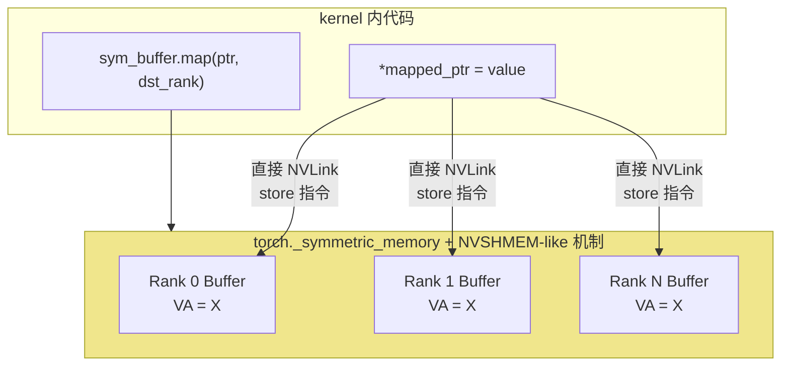

**原理**：PyTorch 2.x 的 `_symmetric_memory` API 让多个 rank 在各自 VA 空间中**同一虚拟地址**映射到不同 rank 的物理内存，kernel 内直接发 load/store 指令即可触发 NVLink 传输。

**相比 NCCL**：
- 无需调用 `nccl*` API（避免 host 同步）
- 粒度可以到单个字节（NCCL 通常要凑整 message）
- 可在 kernel 内混合计算和通信（fused）

#### 4.2 TMA (Tensor Memory Accelerator)

```
传统 cp.async:  Warp 内所有线程协作做 load
                每个线程发 1 个 load 指令
                限制：需要 coalesced 访问，复杂 swizzle 难实现

TMA (SM90+):    1 个线程发 1 条 tma::copy 指令
                描述符 (TmaDescriptor) 预编程 tile 形状 + swizzle + stride
                硬件自动生成所有 load，并写入 mbarrier
                → Producer warp 可用 < 1/32 线程做全 warp 工作量
```

Mega MoE 的用法：
```cpp
if (cute::elect_one_sync()) {   // 只有 1 个线程
    tma::copy<...>(tensor_map, full_barrier, smem_dst, ...);  // 异步 load
    full_barrier->arrive_and_expect_tx(bytes);  // 告知期望字节数
}
// 其余 31 个线程空闲 → 但 SM 已被完整利用（只是被其他 warp 用）
```

#### 4.3 UMMA Block-Scaled FP8×FP4

这是 B200 新增的 block-scaled tensor core 指令：

```
SM100_MMA_MXF8F6F4_2x1SM_SS::fma(
    b_desc, a_desc,           // 操作数描述符
    d_tmem_offset,            // 累加器在 TMEM 的列
    accumulate_flag,          // 是否累加（首次要设 false 初始化）
    instr_desc,               // 指令描述（FP8 E4M3, FP4 E2M1, UE8M0 scale）
    sfb_tmem_col,             // B 的 scale factor 在 TMEM 哪一列
    sfa_tmem_col              // A 的 scale factor 在 TMEM 哪一列
);
```

**Block-Scaled 的含义**：每 32 个元素共享 1 个 UE8M0 scale factor（8 位浮点，相当于 1<<exp）。UMMA 硬件自动做：

```
output[i] = Σ_k A[i,k] × SFA[i/32][k/32] × B[k,j] × SFB[k/32][j/32]
```

→ **FP4 权重但精度接近 BF16**。是 Blackwell 实现 4500 TFLOPS FP4 的硬件基础。

#### 4.4 UTCCP (Uniform Tensor Core Copy Pipeline)

```
传统: SF 存在 SMEM → MMA 执行时从 SMEM 查表 (每次都要访问 SMEM)
UTCCP:  SF 一次性从 SMEM 复制到 TMEM → MMA 执行时从 TMEM 查表 (本地访问更快)

cute_utccp_t::copy(sf_desc, tmem_col);
// 在一个 warp 内发射，2 CTA 共享 TMEM
```

**收益**：TMEM 访问延迟 < SMEM < HBM，SF 查表频繁，放到 TMEM 里可减少 SMEM bank conflict 和延迟。

#### 4.5 Wave-Based Scheduler

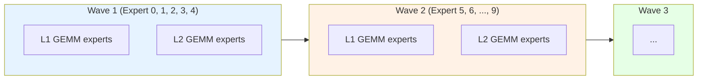

**关键**：`kNumExpertsPerWave=5` 是根据 SM 数和每 expert 的 block 数**动态计算**的：

```cpp
num_experts_per_wave = ⌈148 / tokens_per_expert × num_m_blocks × num_n_blocks⌉
```

每个 wave 内，所有 expert 的所有 (M, N) tile 分散到 148 个 SM 上。一个 wave 的 L1 完成 → L2 开始。**L1/L2 之间需要跨 block 同步（`l2_arrival_mask`），但不需要跨 rank**。

#### 4.6 PDL (Programmatic Dependent Launch)

```
__grid_constant__ cute::TmaDescriptor tensor_map_l1_acts;
                          ↑
                          └── 在 kernel launch 时由 host 写入
                               每次 launch 都会重新复制到 constant memory
```

PDL 允许：
1. **TMA descriptor 直接作为 `__grid_constant__` 参数传入**，省去 setup kernel
2. **依赖前序 kernel 的事件**（通过 `cuLaunchKernelEx` + attr）自动重叠

在 Mega MoE 里，PDL 让 CPU 端只需 1 次 launch，无需额外 setup。

#### 4.7 Per-Block Arrival（细粒度跨 Block 数据依赖）

```cpp
// L1 Epilogue 写完某个 N block 后
red_or_rel_gpu(l2_arrival_mask[pool_block], 1ull << n_block_idx);

// L2 TMA-A 等待需要的 N block
while ((cached_mask & needed_bits) != needed_bits)
    cached_mask = ld_acq_gpu(l2_arrival_mask[pool_block]);
```

**这不是归约，是数据依赖通知**：L2 的 K block 需要 L1 的 N block 作为输入，`l2_arrival_mask` 是一个 64-bit 位图，每 bit 对应一个 N block。

**原子操作**：
- `red_or_rel` = atomic OR with release semantics（写侧）
- `ld_acq_gpu` = atomic load with acquire semantics（读侧）

→ 跨 SM 数据同步，但 **完全无锁**。

#### 4.8 Fast Math 与精度

```cpp
if constexpr (kFastMath) {
    gate = __fmul2_rn(gate, {fast_rcp(denom.x), fast_rcp(denom.y)});
    neg_exp = __expf(-gate);  // 硬件快速 exp
}
```

- `__expf` ≈ 20 cycles，精度 ULP ≈ 2
- `__fdivide` (默认) ≈ 100 cycles，精度 ULP ≈ 0.5
- Fast math **仅在激活函数中使用**，GEMM 累加仍然是 FP32 精确累加

→ SwiGLU 计算加速 3-5 倍，端到端误差 < 1e-3（BF16 输出量化误差远大于此）。

---

### 5. 与传统实现的对比

#### 5.1 传统多 kernel 实现

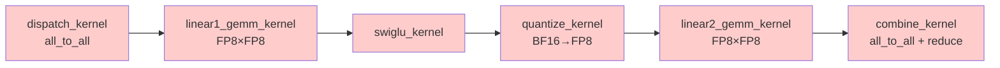

6 次 launch，5 次中间 HBM 读写，NCCL 通信无法与计算重叠。

#### 5.2 Mega MoE 实现

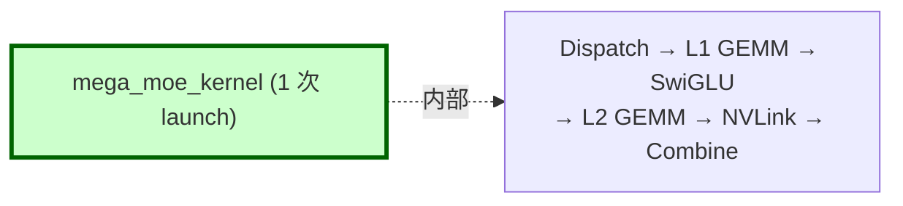

1 次 launch，中间数据走 SMEM/TMEM，NVLink 通信与 GEMM 重叠。

#### 5.3 性能数据对比（从 benchmark）

| 指标 | 传统 MoE (~推测) | Mega MoE | 收益 |
|------|------------------|----------|------|
| 总耗时 (T=1024/rank) | ~4500 us | 3114 us | **1.44x** |
| TFLOPS (FP8 effective) | ~1400 | 2090 | **1.49x** |
| HBM 峰值 | ~600 GB/s | 984 GB/s | **1.64x** |
| NVLink 带宽 | 串行等待 | 353 GB/s 并发 | ∞ |
| Kernel launch 次数 | 6+ | 1 | 6x |
| 中间 HBM 读写 | 5 次 | 0 次 | - |

#### 5.4 关键约束与权衡

| 约束 | 代价 | 收益 |
|------|------|------|
| 需要持久化 kernel | 单个 kernel 执行时间长，难 profile | 消除 launch 开销，缓存保留 |
| 需要 NVLink barrier | NCU replay 失效（本次实践验证） | 跨 rank 精细同步 |
| 需要 symmetric memory | PyTorch 2.x only | 零拷贝 NVLink |
| 需要 SM100 硬件 | 仅 B200/B300 | FP4 tensor core + TMEM |
| Shared memory 占用极高 | 只能 1 block/SM | TMA multi-stage pipeline |
| Warp 专业化复杂 | 调试/修改难度大 | 99% SM 利用率 |

---

### 附录：设计决策速查表

| 决策 | 原理 | 代码位置 |
|------|------|---------|
| 4+4+8 warp 分配 | 生产者-消费者+通信器三方专业化 | 模板参数 `kNumDispatchThreads` 等 |
| 寄存器 48/40/208 | 总和 98.4% 且按需分配 | `warpgroup_reg_alloc/dealloc` |
| 2-CTA cluster | 共享 TMEM + UMMA multicast | `cluster_sync()`, `is_leader_cta` |
| 6-stage pipe | TMA latency / MMA latency ≈ 3 | `kNumStages = 6` |
| 2 TMEM accumulator | MMA/Epilogue 流水不等待 | `kNumEpilogueStages` |
| Swap A/B | M<<N 时节省 SMEM 压力 | UMMA desc 构造 |
| Output-Stationary | 消除跨 CTA reduce | `l1/l2_arrival_count/mask` |
| Persistent kernel | 单次 launch 完成所有 expert | grid size = `kNumSMs` |
| Wave scheduler | 平衡 expert 粒度与 SM 数 | `kNumExpertsPerWave` |
| Symmetric memory | Kernel 内直发 NVLink store | `sym_buffer.map()` |
| Fast math epilogue | 激活函数加速 5x | `__expf`, `fast_rcp` |
| Per-block arrival | 细粒度数据依赖，无锁 | `red_or_rel`, `ld_acq` |

---

# 第四章：Warp 间 Barrier 机制深度剖析

> 剖析 `sm100_fp8_fp4_mega_moe.cuh` 中所有 Warp/Block/Cluster/Rank 级同步原语的底层机制、作用域、握手协议与死锁预防策略。

---

## 4.1 Barrier 体系全景

Mega MoE kernel 内部共使用 **5 种层级、10 类具体 barrier**，它们覆盖从 warp 内 handshake 到跨 rank 的 NVLink 同步。

```
                  ┌───────────────────────────────────────────────┐
作用域层级         │                                               │  延迟数量级
                  │                                               │
  Warp 内         │  __syncwarp() / elect_one_sync                │  <10 cycles
                  │                                               │
  Warpgroup/CTA   │  bar.sync (sync_aligned)                      │  ~30-50 cycles
                  │  barrier.sync (sync_unaligned)                │  ~50-100 cycles
                  │                                               │
  Cluster (2CTA) │  mbarrier (ClusterTransactionBarrier)         │  ~100-300 cycles
                  │    ├─ full / empty                            │
                  │    ├─ tmem_full / tmem_empty                  │
                  │    ├─ dispatch (per-warp)                     │
                  │    └─ combine (per-warp)                      │
                  │                                               │
  Grid (Intra-SM)│  grid_sync (atomic on workspace)              │  ~1-2 μs
                  │  per-block arrival (l1_count, l2_mask)        │  spin-wait
                  │                                               │
  Cross-rank     │  nvlink_barrier (atomic via NVLink)           │  ~4 μs
                  │                                               │
                  └───────────────────────────────────────────────┘
```

### 4.1.1 一张表看懂所有 Barrier

| # | Barrier 名称 | 类型 | PTX 指令 | 生产者 | 消费者 | Arrive count | 作用 |
|---|------|------|---------|--------|--------|--------------|------|
| 1 | `dispatch_barriers[w]` | mbarrier | `mbarrier.arrive.expect_tx` + `try_wait.parity` | TMA 硬件 | Warp w 自身 | 1 | 单个 Dispatch warp 的 per-token TMA pull 完成通知 |
| 2 | `full_barriers[s]` | mbarrier (ClusterTrans) | `cp.async.bulk ... .mbarrier::complete_tx::bytes` + `arrive_and_expect_tx` | TMA 硬件（tokens+weights） | MMA warp | 2×2=4 | Stage s 的 A/B tile 完全就绪 → MMA 可消费 |
| 3 | `empty_barriers[s]` | mbarrier | `umma_arrive_multicast_2x1SM` | MMA warp (UMMA 完成) | TMA A/B warps | 1 | Stage s 的数据已消费 → TMA 可覆写 |
| 4 | `tmem_full_barriers[e]` | mbarrier | `umma_arrive_multicast_2x1SM` | MMA warp | 所有 Epilogue warps | 1 | TMEM 累加器 e 写就绪 → Epilogue 可读 |
| 5 | `tmem_empty_barriers[e]` | mbarrier | `mbarrier.arrive` | Epilogue warps | MMA warp | 2×256 | TMEM 累加器 e 已读完 → MMA 可覆写 |
| 6 | `combine_barriers[w×2+b]` | mbarrier | `mbarrier.arrive.expect_tx` | TMA 硬件 | Epilogue warp w | 1 | Combine 阶段 double-buffer load 完成 |
| 7 | `kDispatchBarrierIdx (0)` | Named Barrier | `bar.sync 0, 128` | Dispatch warps | Dispatch warps | 128 | 4 个 Dispatch warp 内同步 |
| 8 | `kDispatchWithEpilogueBarrierIdx (1)` | Named Barrier | `barrier.sync 1, 384` | Dispatch + Epilogue | Dispatch + Epilogue | 384 (unaligned) | 分隔 Dispatch pull 与 Combine reduce，防止死锁 |
| 9 | `kEpilogueFullBarrierIdx (2)` | Named Barrier | `bar.sync 2, 256` | Epilogue warps | Epilogue warps | 256 | 8 个 Epilogue warp 全局同步 |
| 10 | `kEpilogueWGBarrierStartIdx (3/4)` | Named Barrier | `bar.sync 3/4, 128` | 单个 Epilogue WG | 单个 Epilogue WG | 128 | 每个 4-warp WG 内同步 |
| 11 | `grid_sync<idx>` | Atomic counter | `atomic_add_rel` + `ld_acq` loop | 所有 SM | 所有 SM | kNumSMs | Intra-rank 所有 SM 到达 |
| 12 | `l1_arrival_count[b]` | Atomic counter | `red_add_rel` + `ld_acq` loop | Dispatch warps | TMA-A warp | N tokens | Block b 的 tokens 全部就绪 |
| 13 | `l2_arrival_mask[b]` | Atomic bitmask | `red_or_rel_gpu` + `ld_acq_gpu` | L1 Epilogue | L2 TMA-A warp | bitmask | Block b 的 N block 就绪 |
| 14 | `nvlink_barrier` | Cross-rank signal | `red_add_rel_sys` + `ld_acq_sys` | SM 0 / 所有 rank | SM 0 / 所有 rank | kNumRanks | 跨 rank 同步点（dispatch 前/combine 前/cleanup 后） |

---

## 4.2 硬件基础：mbarrier 的工作原理

Mega MoE 中最核心的 Warp 间 barrier 是 SM80+ 引入、SM90/SM100 大幅强化的 **mbarrier**（Memory Barrier）。理解它的内部状态机是读懂本 kernel 同步逻辑的钥匙。

### 4.2.1 mbarrier 的 64-bit 状态

每个 mbarrier 占用 shared memory 中的一个 8-byte 槽位，64 位拆解如下：

```
┌───────────────┬───────────────┬───────────────┬───────────────┐
│  phase bit    │  arrive count │  expected_tx  │  pending_tx   │
│    (1 bit)    │  (15 bits)    │    (20 bits)  │    (20 bits)  │
│               │  current /    │               │  remaining    │
│               │  initial      │               │  bytes to     │
│               │               │               │  arrive       │
└───────────────┴───────────────┴───────────────┴───────────────┘
      ↑
      当 arrive count 归零 + pending_tx 归零 时翻转
```

三个关键计数：

| 计数 | 作用 | 触发方式 |
|------|------|---------|
| **arrive count** | 记录还需多少个 thread "到达"（`arrive`）才能翻相位 | 初始值 = `init(N)` 中的 N；每次 `arrive()` 减 1 |
| **expected_tx** | 告诉 barrier "还将从 TMA 收到多少字节" | `arrive_and_expect_tx(bytes)` 设置 |
| **pending_tx** | 实际到达的 TMA 字节数 | `cp.async.bulk.mbarrier::complete_tx::bytes` 硬件自动累加 |

**翻相位条件（barrier "完成"）：**

```
arrive_count == 0  AND  pending_tx == expected_tx
       ↓
   phase ^= 1，arrive_count 重置为 initial，expected_tx/pending_tx 清零
```

### 4.2.2 Phase Bit：避免 ABA 问题的关键

mbarrier 的等待指令 `mbarrier.try_wait.parity` 比较的是 **相位**，不是计数。每次完成一轮 barrier，相位翻转一次：

```c++
// Wait 的实现（deep_gemm/ptx/tma.cuh）
CUTLASS_DEVICE void mbarrier_wait_and_flip_phase(
    cutlass::arch::ClusterTransactionBarrier* ptr, uint32_t& phase) {
    asm volatile(
        "LAB_WAIT: \n\t"
        "mbarrier.try_wait.parity.shared::cta.b64 P1, [%0], %1, %2; \n\t"
        "@P1 bra DONE; \n\t"
        "bra     LAB_WAIT; \n\t"
        "DONE: \n\t" ::
        "r"(bar_addr), "r"(phase), "r"(0x989680));  // 0x989680 = 10M cycle timeout
    phase ^= 1;  // Software 端也翻转
}
```

调用方维护一个 software phase 变量，**每次 wait 后翻转**。硬件的 phase 也独立翻转，当两者匹配时才放行：

```
轮次 0: wait(phase=0) → hardware phase=0 → 匹配 → 放行 → phase=1
轮次 1: wait(phase=1) → hardware phase=1 → 匹配 → 放行 → phase=0
轮次 2: wait(phase=0) → hardware phase=0 → 匹配 → 放行 → phase=1
...
```

**为什么需要 phase？** 如果只比较 arrive count，就会遇到 **ABA 问题**：producer 可能在 consumer 还没 wait 前就再次 arrive。Phase bit 把 barrier 的"第 N 次使用"唯一化，避免误判。

### 4.2.3 Transaction Count：TMA 的精确同步

`ClusterTransactionBarrier` 是 mbarrier 的子类，额外支持 **transaction count**。当 TMA 发起搬运时：

```c++
// TMA 硬件会在每次字节到达时 atomic 地减少 pending_tx
asm volatile(
    "cp.async.bulk.shared::cluster.global.mbarrier::complete_tx::bytes.L2::cache_hint "
    "[%0], [%1], %2, [%3], %4;\n" ::
    "r"(smem_dst), "l"(src), "r"(num_bytes),
    "r"(bar_addr), "l"(hint) : "memory");
```

Producer（TMA issue warp）同时告知 barrier "本次 arrive 同时期望到 N 字节"：

```c++
full_barriers[stage_idx]->arrive_and_expect_tx(SMEM_A_SIZE_PER_STAGE * 2 + SF_BLOCK_M * 8);
// arrive_count -= 1
// expected_tx += (SMEM_A_SIZE + SF_SIZE) bytes
```

只有当 `arrive_count == 0 && pending_tx == expected_tx` 时才翻相位。这就实现了 **"N 个 warp 都 arrive 了，且 M 字节全部 TMA 到达"** 的组合条件。

---

## 4.3 逐个 Barrier 详细剖析

下面按 barrier 类型深入分析每个的初始化参数、触发协议、与哪些 warp 握手。

### 4.3.1 `dispatch_barriers[w]` — 每 Warp 一个的 TMA pull 信号

**用途：** 每个 Dispatch warp 独立进行 "NVLink TMA pull → wait → TMA store" 的循环。每 pull 一个 token 需要一次握手。

**初始化**（warp 1，位于 kernel 开头）：

```c++
else if (warp_idx == 1) {
    #pragma unroll
    for (uint32_t i = lane_idx; i < kNumDispatchWarps; i += 32)
        dispatch_barriers[i]->init(1);   // ← arrive count = 1
    cutlass::arch::fence_barrier_init();
}
```

`init(1)` 表示只需要 **1 次 arrive** 就翻相位——因为 TMA 硬件自己是 "producer"，arrive 的只是 warp 里的一个 leader lane。

**握手协议：**

```c++
// 一个 Dispatch warp 处理一个 token
if (cute::elect_one_sync()) {                             // 只有 1 个 lane 发指令
    ptx::tma_load_1d(pull_buffer, remote_src,
                     pull_mbarrier, kHidden);             // 发起 NVLink TMA load
}

// ... 同时并发做 SF 拷贝 ...

if (cute::elect_one_sync()) {
    ptx::mbarrier_arrive_and_set_tx(pull_mbarrier, kHidden); // arrive + 期望 kHidden 字节
    ptx::mbarrier_wait_and_flip_phase(pull_mbarrier, phase); // spin 等待
    // 此时 TMA pull 已完成
    ptx::tma_store_1d(...);                              // 继续 TMA store
}
```

**关键点：** `arrive_and_set_tx` 不是告知 barrier "我到了"，而是 **"TMA 将会送来 kHidden 字节，我等着"**。真正让 `pending_tx` 增长的是 TMA 硬件本身。

### 4.3.2 `full_barriers[s]` — TMA Producer → MMA Consumer 的经典流水 barrier

**初始化**（warp 2，kernel 开头）：

```c++
#pragma unroll
for (uint32_t i = 0; i < kNumStages; ++ i) {
    full_barriers[i]->init(2 * 2);   // ← arrive count = 4
    empty_barriers[i]->init(1);
}
```

**为什么 `full_barriers` init=4？**

这是理解 2-CTA cluster 下 barrier 语义的核心：

```
每个 Stage 的 A tile 和 B tile 要从 TMA 分别到达 2 个 CTA（Cluster 内两个 SM）：

  Leader CTA (SM i):
    TMA-A warp: tma::copy(tokens)           → full_barriers[s]·arrive (1)
    TMA-A warp: tma::copy(SFA)              → full_barriers[s]·arrive (1)   合并为 1 次 arrive_and_expect_tx
    TMA-B warp: tma::copy(weights)          → full_barriers[s]·arrive (1)
    TMA-B warp: tma::copy(SFB)              → full_barriers[s]·arrive (1)

  Non-leader CTA (SM i+1):
    对等 4 次 arrive (但 expect_tx=0)
```

实际代码中，TMA-A 和 TMA-B warp 各自在自己那里只调一次 `arrive_and_expect_tx`（合并了 tokens+SFA 两次 copy 的字节数），两个 CTA 各 arrive 1 次 → 总计 **2 warp × 2 CTA = 4 次 arrive**。

```c++
// TMA-A warp (warp 4)
tma::copy<...>(tensor_map_a_ptr, full_barriers[stage_idx], smem_a[stage_idx], ..., 2);
tma::copy<...>(tensor_map_sfa_ptr, full_barriers[stage_idx], smem_sfa[stage_idx], ..., 2);
if (is_leader_cta) {
    full_barriers[stage_idx]->arrive_and_expect_tx(
        SMEM_A_SIZE_PER_STAGE * 2                       // tokens × 2 CTA
        + SF_BLOCK_M * sizeof(uint32_t) * 2             // SFA   × 2 CTA
    );
} else {
    full_barriers[stage_idx]->arrive(0u);                // Non-leader 只 arrive 不 expect
}
```

**MMA 端的 consumer：**

```c++
// MMA warp (warp 6, only leader CTA)
full_barriers[stage_idx]->wait(phase);        // ← 等待 4 次 arrive + 总字节到齐
ptx::tcgen05_after_thread_sync();             // MMA 侧的内存序栅栏
// 发射 UMMA...
```

### 4.3.3 `empty_barriers[s]` — MMA 反向通知 TMA 可以覆写

**初始化：**`init(1)` — 只需 1 次 arrive。

**反向握手的巧妙之处：** MMA 不用普通的 `arrive`，而是用 **UMMA 的 multicast arrive**：

```c++
auto empty_barrier_arrive = [&](const bool& do_tmem_full_arrive) {
    auto umma_arrive = [](const uint64_t* barrier) {
        constexpr uint16_t kCTAMask = (1 << 2) - 1;                     // 两个 CTA 都通知
        cutlass::arch::umma_arrive_multicast_2x1SM(barrier, kCTAMask);  // tcgen05.commit
    };
    umma_arrive(reinterpret_cast<uint64_t*>(empty_barriers[stage_idx]));
    // 只有 K-loop 的最后一个 block 才 arrive tmem_full
    if (do_tmem_full_arrive)
        umma_arrive(reinterpret_cast<uint64_t*>(tmem_full_barriers[accum_stage_idx]));
};
```

对应 PTX：

```
tcgen05.commit.cta_group::1.mbarrier::arrive::one.shared::cluster.b64 [%0];
```

**为什么用 `tcgen05.commit` 而非 `mbarrier.arrive`？**

UMMA 是异步的——`SM100_MMA_MXF8F6F4_2x1SM_SS::fma()` 发射后并不立即完成。如果用普通的 `mbarrier.arrive`，会在 UMMA 还在跑的时候就通知 consumer。`tcgen05.commit` 的语义是 **"当所有前置的 UMMA 都真正完成时才 arrive"**——硬件保证 UMMA 的完成顺序与 commit 顺序一致。

这意味着 MMA warp 不需要显式等 UMMA 完成，直接发 commit 即可继续下一轮，**UMMA 自己会在后台完成后 arrive barrier**——这是 SM100 异步张量核心的核心优势。

**TMA warp 的 wait：**

```c++
// TMA-A warp (warp 4) 和 TMA-B warp (warp 5) 都有这一行
empty_barriers[stage_idx]->wait(phase ^ 1);
```

注意这里的 `phase ^ 1`——因为 full/empty 的相位是 **反相**的：stage 首次使用时 full 是 phase 0，empty 是 phase 1（初始视为已 empty）。

### 4.3.4 `tmem_full_barriers[e]` / `tmem_empty_barriers[e]` — TMEM 流水线

**初始化：**

```c++
tmem_full_barriers[i]->init(1);                       // 1 次 arrive (MMA 的 commit)
tmem_empty_barriers[i]->init(2 * kNumEpilogueThreads);// 2 × 256 = 512 次 arrive
```

**为什么 `tmem_empty` init = 2 × 256？**

```
两个 CTA 的所有 Epilogue 线程都要 arrive:
  - Leader CTA 的 256 个 Epilogue 线程
  - Non-leader CTA 的 256 个 Epilogue 线程
  - 总计 512 次

每个 Epilogue 线程读完 TMEM 后调用:
  tmem_empty_barriers[accum_stage_idx]->arrive(0u);  // 普通 mbarrier.arrive
```

但是等等——代码中 Epilogue 调用 `arrive(0u)` 时，实际只有少数几个 warp 会发起 arrive（通过 `lane_idx == 0` 等 elect），**为什么 init 是 512？**

答案藏在 PTX 里：`mbarrier.arrive.shared::cta.b64` 每次调用就让 arrive_count **减 1**，但是在 SM90+ 上，**如果通过 thread 发射，硬件会以一个线程为单位减 1，但如果是通过 warp 级原语如 `cute::elect_one_sync`，则只有 elected lane 会执行**。

实际 Mega MoE 的代码中：

```c++
// Linear1 epilogue 的最后一个 atom
if (j == WG_BLOCK_M / ATOM_M - 1) {
    ptx::tcgen05_before_thread_sync();
    tmem_empty_barriers[accum_stage_idx]->arrive(0u);  // 注意：没有 elect_one
}
```

**没有 `elect_one_sync`，意味着整个 warp 的 32 个 lane 都会执行到这行**。一个 warp 的 32 次调用 = 32 次 arrive。8 个 Epilogue warp × 32 lane = 256，加上两个 CTA = 512 = 2 × 256。精确匹配 init 值。

这是一个很精巧的设计：**用 "所有线程同时 arrive" 替代 "一个 leader arrive N 次"**，避免 elect 的开销并自动支持 2-CTA。

### 4.3.5 `combine_barriers[i]` — Combine 阶段的双缓冲 TMA

**初始化：**

```c++
for (uint32_t i = 0; i < kNumEpilogueWarps * 2; ++ i)
    combine_barriers[i]->init(1);  // Per-warp × 2 stage
```

**握手模式（与 `dispatch_barriers` 类似）：**

```c++
// 每个 Epilogue warp 独立处理一个 token 的 topk combine
auto combine_load_barriers = [&](uint32_t i) {
    return combine_barriers[i + epilogue_warp_idx * 2];  // 每 warp 占 2 个 barrier
};

// Double-buffered pipeline
bool do_reduce = move_mask_and_load(load_stage_idx);     // 启动 stage 0 load
while (do_reduce) {
    do_reduce = move_mask_and_load(load_stage_idx ^ 1);  // 启动 stage 1 load（prefetch）
    
    combine_load_barriers[load_stage_idx]->wait(combine_phase);  // 等 stage 0 完成
    // 累加 stage 0...
    
    combine_phase ^= load_stage_idx;                      // 翻 phase（仅当 stage 0 消费完）
    load_stage_idx ^= 1;                                  // 切换 stage
}
```

**`combine_phase ^= load_stage_idx` 的含义：** 只有当 `load_stage_idx == 0` 时 `combine_phase` 才翻（因为 `0 ^ phase = phase`，`1 ^ phase ≠ phase`，wait 实际上是 XOR 运算）——这确保两个 stage 的 phase 独立推进。

---

## 4.4 Named Barrier（`bar.sync` / `barrier.sync`）

除了 mbarrier，Mega MoE 还使用 **PTX Named Barriers**（硬件保留的 16 个），通过整数索引 0-15 引用：

### 4.4.1 硬件指令

```c++
CUTLASS_DEVICE void sync_aligned(const uint32_t& num_threads, const uint32_t& barrier_idx) {
    asm volatile("bar.sync %0, %1;" : : "r"(barrier_idx), "r"(num_threads));
}

CUTLASS_DEVICE void sync_unaligned(const uint32_t& num_threads, const uint32_t& barrier_idx) {
    asm volatile("barrier.sync %0, %1;" : : "r"(barrier_idx), "r"(num_threads));
}
```

| 指令 | 要求 | 成本 | 用法 |
|------|------|------|------|
| `bar.sync` | 必须所有线程都执行到且 `num_threads` 是 32 的倍数 | ~30 cycles | 同一 warp group 内同步 |
| `barrier.sync` | 允许线程数不对齐（比如跨 warp 角色混合） | ~50-100 cycles | 跨异构 warp 同步 |

### 4.4.2 Mega MoE 使用的 4 个 Named Barrier ID

```c++
constexpr uint32_t kDispatchBarrierIdx = 0;              // Dispatch 内部同步 (128T)
constexpr uint32_t kDispatchWithEpilogueBarrierIdx = 1;  // 跨角色同步 (384T, unaligned)
constexpr uint32_t kEpilogueFullBarrierIdx = 2;          // Epilogue 全体同步 (256T)
constexpr uint32_t kEpilogueWGBarrierStartIdx = 3;       // Epilogue WG 内 (128T) — 使用 id 3 和 4
```

### 4.4.3 `kDispatchWithEpilogueBarrierIdx = 1` — 最关键的反死锁 barrier

这个 barrier 的作用容易被忽略但极其关键。它同步 **Dispatch (128T) + Epilogue (256T) = 384 线程**，使用 `barrier.sync` 因为 384 不是 32 对齐的连续区间（跳过了 Warp 4-7 的 128 线程）。

**出现的三个位置：**

```c++
// 位置 1: Dispatch 端 — "我要开始 pull 了"
ptx::sync_unaligned(kNumDispatchThreads + kNumEpilogueThreads, 1);

// 位置 2: Dispatch 端 — "我 pull 完了，准备 cleanup"
ptx::sync_unaligned(kNumDispatchThreads + kNumEpilogueThreads, 1);

// 位置 3: Epilogue 端 — "我 combine 做完了，你 cleanup 吧"
ptx::sync_unaligned(kNumDispatchThreads + kNumEpilogueThreads, 1);
```

**它防止的死锁场景：**

如果没有这个 barrier，下述顺序会导致 deadlock：

```
时刻 t0:
  Dispatch warps 进入 cleanup 阶段，清零 l1_arrival_count
  同时 Epilogue warps 还在做 Combine，读取 combine_token_buffer

时刻 t1:
  下一轮 kernel 调用开始（persistent 模式下的下一批 tokens）
  Dispatch warps 开始新一轮 Count Tokens，但 Epilogue 还在上一轮 Combine

时刻 t2:
  Epilogue 完成 Combine，进入下一轮 epilogue
  但 Dispatch 已清零了一些 Epilogue 还没用完的元数据 → 数据竞态
```

`kDispatchWithEpilogueBarrierIdx` 强制 **Dispatch 的 cleanup 必须等到 Epilogue 的 combine 结束**。这是一个 "横跨 4 个角色中的 2 个" 的粗粒度同步。

### 4.4.4 `kEpilogueWGBarrierStartIdx` — 双 Warp Group 内部

每个 Epilogue Warp Group（4 warps = 128 threads）有自己的 barrier：

```c++
// Linear1 Epilogue 内
ptx::sync_aligned(128, kEpilogueWGBarrierStartIdx + epilogue_wg_idx);
// epilogue_wg_idx ∈ {0, 1}，所以使用的 barrier id 是 3 和 4
```

作用：**一个 WG 内 4 个 warp 交换 amax 信息时必须对齐 shared memory 写入**。这个 barrier 确保 `smem_amax_reduction` 的跨 warp pair 归约可见。

---

## 4.5 完整的 K-block 握手时序图

把所有 barrier 串起来，一个 K-block 的完整握手如下：

```
Stage s, K-block k 的流水线 (假设是 Linear1 L1 GEMM 的第 k 个 K block):

Time ───────────────────────────────────────────────────────────────→

TMA-A warp (4):
  empty_barriers[s].wait(phase^1)                         ← 等上一轮 MMA 释放
  │
  ├─ tma::copy(tokens, full_barriers[s])                  ← 发起 TMA (硬件自动填 tx)
  ├─ tma::copy(SFA,    full_barriers[s])
  └─ full_barriers[s].arrive_and_expect_tx(bytes)         ← arrive + 期望字节

TMA-B warp (5):
  empty_barriers[s].wait(phase^1)                         ← 同上
  │
  ├─ tma::copy(weights, full_barriers[s])
  ├─ tma::copy(SFB,     full_barriers[s])
  └─ full_barriers[s].arrive_and_expect_tx(bytes)         ← arrive count 变为 0
                                                             AND pending_tx == expected_tx
                                                             → full_barriers[s] 翻 phase

MMA warp (6):
  full_barriers[s].wait(phase)                            ← 匹配 phase，放行
  │
  ├─ UTCCP: smem_sfa → TMEM
  ├─ UTCCP: smem_sfb → TMEM
  ├─ SM100_MMA_MXF8F6F4_2x1SM_SS::fma(b, a, ...)          ← 发射异步 UMMA
  │
  └─ umma_arrive_multicast_2x1SM(empty_barriers[s])       ← tcgen05.commit
                                                             UMMA 完成后自动 arrive
                                                             → empty_barriers[s] 翻 phase
                                                             → 下一轮 TMA 可覆写

  (当 k == last_k) 
  └─ umma_arrive_multicast_2x1SM(tmem_full_barriers[e])   ← TMEM 累加完成通知

Epilogue warps (8-15):
  tmem_full_barriers[e].wait(accum_phase)                 ← 等 MMA 累加完
  │
  ├─ SM100_TMEM_LOAD_16dp256b1x ...                       ← 从 TMEM 读
  ├─ SwiGLU + amax + FP8 cast                             ← 计算
  ├─ sync_aligned(128, WG barrier)                        ← WG 内同步 amax
  ├─ SM90_TMA_STORE_2D ...                                ← 写回 HBM
  ├─ sync_aligned(256, EpilogueFullBarrier)               ← 8 warp 同步
  └─ tmem_empty_barriers[e].arrive(0u) × 256 threads × 2  ← 通知 MMA 可覆写 TMEM
                                                             (arrive count 达到 512)
                                                             → tmem_empty_barriers[e] 翻 phase

   └─ red_or_rel_gpu(l2_arrival_mask, 1 << n_block_idx)   ← 通知下阶段 L2 可读
```

---

## 4.6 Grid / Cross-rank Barrier 机制

### 4.6.1 `grid_sync` — 基于原子计数器的 "高位翻转" 技巧

```c++
template <uint32_t kNumSMs, uint32_t kGridSyncIndex, typename sync_scope_t>
void grid_sync(workspace, sm_idx, thread_idx, sync_scope) {
    constexpr uint32_t kFinishSumTag = 0x80000000u;   // 最高位作为 "完成"tag
    sync_scope();
    if (thread_idx == 0) {
        const auto count_ptr = workspace.get_grid_sync_count_ptr<kGridSyncIndex>();
        const auto old_value = ptx::atomic_add_rel(count_ptr,
            sm_idx == 0 ? (kFinishSumTag - (kNumSMs - 1)) : 1);
        uint32_t new_value;
        do {
            new_value = ptx::ld_acq(count_ptr);
        } while (((new_value ^ old_value) & kFinishSumTag) == 0);
    }
    sync_scope();
}
```

**算法解析：**

```
假设 kNumSMs = 148:
  kFinishSumTag = 0x80000000 (bit 31)
  
  SM 0 加的值: 0x80000000 - 147 = 0x7FFFFF6D
  其他 SM 加的值: 1 (每个)
  
  所有 147 个其他 SM 到达后: counter += 147
  SM 0 到达后: counter += 0x7FFFFF6D (= 0x80000000 - 147)
  
  总和: 0x80000000 - 147 + 147 = 0x80000000 (bit 31 翻转了!)

检测 bit 31 翻转:
  (new_value ^ old_value) & 0x80000000 != 0
  
  → 任何 SM 都能看到 bit 31 从 0 变成 1 (或从 1 变成 0)
  → 即使跨越多次 grid_sync 调用，也能正确检测（因为 bit 31 每次翻转）
```

**为什么不用简单的 "counter == N"？** 因为 persistent kernel 会多次调用 `grid_sync`，如果用累加，需要复杂的 phase 管理。用 bit 31 翻转相当于 **每次 grid_sync 都是一次新的 phase**，天然避免 ABA。

### 4.6.2 `nvlink_barrier` — 跨 rank 的 NVLink 同步

```
nvlink_barrier 的三阶段:

  Stage 1: 前置 grid_sync (可选)
    ├─ 确保本 rank 所有 SM 到达，没有正在读写的 SM
  
  Stage 2: Cross-rank 握手 (仅 SM 0)
    ├─ 计算 signal_phase (0 or 1) 和 signal_sign (+1 or -1)
    ├─ thread i (i < kNumRanks) 向 rank i 发 red_add_rel_sys(signal, ±1)
    ├─ thread 0 等待本地 signal 达到目标值 (= 0 或 = kNumRanks)
    └─ 超时 30 秒 → DG_DEVICE_ASSERT
  
  Stage 3: 后置 grid_sync (可选)
    ├─ 确保 SM 0 的跨 rank 同步信息传达给本 rank 所有 SM
```

**为什么 signal 要交替 ±1？**

```
状态机 (status = *counter_ptr & 3):
  counter 的 bit 0: signal_phase (使用哪个 signal 槽)
  counter 的 bit 1: signal_sign  (这次加 +1 还是 -1)

每次 nvlink_barrier 后 counter++:
  状态 0 (phase=0, sign=0): 用 signal[0], 加 +1,  等 counter == kNumRanks
  状态 1 (phase=1, sign=0): 用 signal[1], 加 +1,  等 counter == kNumRanks
  状态 2 (phase=0, sign=1): 用 signal[0], 加 -1,  等 counter == 0
  状态 3 (phase=1, sign=1): 用 signal[1], 加 -1,  等 counter == 0
  然后 wrap 回状态 0

好处:
  - 无需清零: signal 在 +1/-1 交替下自然归零
  - 两个 signal 槽轮换: phase 0 还在等的时候, phase 1 已经可以开始新一轮
  - 避免 ABA 问题
```

### 4.6.3 3 个 NVLink Barrier 的时序

Mega MoE kernel 生命周期内只调用 **3 次 nvlink_barrier**：

```c++
constexpr uint32_t kBeforeDispatchPullBarrierTag = 1;    // 进入 pull 阶段前
constexpr uint32_t kBeforeCombineReduceBarrierTag = 2;   // 进入 combine 前
constexpr uint32_t kAfterWorkspaceCleanBarrierTag = 3;   // Cleanup 完成后

时间线:
  t0:  Grid 开始
  t1:  Dispatch: Count → Grid sync → Write expert count
  t2:  ▼ nvlink_barrier #1 (kBeforeDispatchPullBarrierTag)
       ▼ 所有 rank 的 expert count 写完后才开始 pull
  t3:  Dispatch pull + L1/L2 GEMM (跨 rank 无同步，持续 2-3 ms)
  t4:  L2 NVLink 写入 combine_buffer
  t5:  ▼ nvlink_barrier #2 (kBeforeCombineReduceBarrierTag)
       ▼ 所有 rank 写完后才开始 combine reduce
  t6:  Combine reduce (Epilogue warps) + Cleanup (Dispatch warps) 并发
  t7:  ▼ nvlink_barrier #3 (kAfterWorkspaceCleanBarrierTag)
       ▼ 所有 rank cleanup 完后才退出 kernel
  t8:  Grid 结束
```

**注意：** NVLink barrier 不会打断正常的 compute，只在关键的"发布数据"前后做同步。所有细粒度的跨 rank 数据依赖（如 L1→L2）都通过 **per-block arrival** 完成，不经过全局 barrier。

---

## 4.7 Per-block Arrival：无锁跨 Block 数据依赖

### 4.7.1 `l1_arrival_count[pool_block]` — Dispatch → TMA-A

**语义：** 一个 pool block (BLOCK_M 个 token) 的 tokens 全部 pull 到位后，TMA-A warp 才能加载。

**写入侧（Dispatch warp，每个 token 一次）：**

```c++
ptx::red_add_rel(
    workspace.get_l1_arrival_count_ptr(expert_pool_block_offset + token_idx_in_expert / BLOCK_M),
    1);
```

PTX 指令：`red.release.gpu.add.u32 [%0], %1;`
- `.release` = release 语义，保证之前所有 store 在此 atom 前全局可见
- `.gpu` = GPU 级别的原子（覆盖所有 SM）

**读取侧（TMA-A warp，每个 Block 等一次）：**

```c++
if (block_phase == BlockPhase::Linear1) {
    const auto ptr = workspace.get_l1_arrival_count_ptr(pool_block_idx);
    const auto expected = scheduler.template get_valid_m<false>();   // 该 block 的 token 数
    while (ptx::ld_acq(ptr) != expected);                             // spin-wait
}
```

PTX 指令：`ld.acquire.gpu.b32`
- `.acquire` = acquire 语义，保证后续 load 看到对应 release 之前的 store

**为什么不用 mbarrier？** 因为 **写入方（Dispatch）和读取方（TMA-A）可能在不同 SM 上**，而 mbarrier 只能跨 cluster（2 个 CTA），不能跨任意 SM。必须用全局原子操作。

### 4.7.2 `l2_arrival_mask[pool_block]` — L1 Epilogue → L2 TMA-A

**语义：** 一个 N-block 的 L1 FP8 output 写完后，L2 TMA-A 可以开始加载对应的 K-block。

**为什么用 bitmask 而非 counter？**

L1 的 N-block 有 48 个（DeepSeek V3 配置），但 L2 的 K-block 粒度不同。`BLOCK_K == BLOCK_N`，所以 L2 的 K=k 需要 L1 的 N=2k 和 N=2k+1 两个块就绪：

```c++
const uint64_t needed = 3ull << (k_block_idx * 2);   // 连续 2 bit
while ((cached_l2_arrival_mask & needed) != needed) {
    cached_l2_arrival_mask = ptx::ld_acq_gpu(ptr);
}
```

如果用 counter 就无法表达"需要具体哪两个 N block 就绪"。Bitmask 让每个 N block 一一对应，通过 `AND` 快速检查子集。

**写入侧：**

```c++
ptx::red_or_rel_gpu(
    workspace.get_l2_arrival_mask_ptr(pool_block_idx),
    1ull << n_block_idx
);
```

PTX: `red.release.gpu.or.b64 [%0], %1;` — **atomic OR** 操作，保证多个 L1 epilogue 并发写同一 mask 不丢 bit。

---

## 4.8 初始化阶段的 Warp 分工

Kernel 开头的初始化阶段（28 行代码）完美展示了 4 个 warp 的并发初始化：

```c++
cute::cluster_sync();  // ← 进入 kernel 后，Cluster 内两个 CTA 同步

if (warp_idx == 0) {
    // 清零 smem_expert_count
    if (cute::elect_one_sync())
        ptx::st_shared_bulk(smem_expert_count, kNumExperts * sizeof(uint32_t));
} else if (warp_idx == 1) {
    // 初始化 dispatch_barriers
    for (uint32_t i = lane_idx; i < kNumDispatchWarps; i += 32)
        dispatch_barriers[i]->init(1);
    cutlass::arch::fence_barrier_init();
} else if (warp_idx == 2) {
    // 初始化 GEMM 全套 barriers
    if (cute::elect_one_sync()) {
        for (...) {
            full_barriers[i]->init(2 * 2);
            empty_barriers[i]->init(1);
        }
        for (...) {
            tmem_full_barriers[i]->init(1);
            tmem_empty_barriers[i]->init(2 * kNumEpilogueThreads);
        }
        for (...)
            combine_barriers[i]->init(1);
    }
    cutlass::arch::fence_barrier_init();
} else if (warp_idx == 3) {
    // 分配 TMEM
    Allocator().allocate(kNumTmemCols, tmem_ptr_in_smem);
}

cute::cluster_sync();  // ← 所有初始化完成，进入计算阶段
```

**4 个核心原则：**

1. **`cluster_sync` 在前后**：确保 2-CTA cluster 的 TMEM 分配一致（TMEM 是 cluster 级资源）。
2. **`fence_barrier_init`**：保证 `mbarrier.init` 对后续的 `wait/arrive` 可见（这是 SM90 引入的 fence 指令）。
3. **每个 warp 只做一件事**：避免多个 warp 同时写同一块 shared memory。
4. **`elect_one_sync`**：对可并行化的工作（如 `st_shared_bulk`），只让一个 lane 执行，节省带宽。

---

## 4.9 Barrier 开销与性能影响

### 4.9.1 延迟对比表

| Barrier 类型 | 最优延迟 | 实测延迟（稳态） | 占用频率 |
|------|---------|---------|---------|
| `__syncwarp()` | <5 cycles | ~10 cycles | 非常频繁 (~每 10 指令) |
| `bar.sync` (warp group) | ~30 cycles | ~40 cycles | 频繁 (每 tile) |
| `barrier.sync` (unaligned) | ~50 cycles | ~100 cycles | 少（3 次 per kernel） |
| mbarrier wait (full/empty) | ~100 cycles | **0**（流水线重叠） | 每 stage |
| mbarrier wait (tmem) | ~200 cycles | **0**（流水线重叠） | 每 K-loop |
| `l1_arrival_count` spin | 2-50 μs | 通常 <1 μs | 每 Linear1 block |
| `l2_arrival_mask` spin | 1-10 μs | 通常 <0.5 μs | 每 Linear2 block |
| `grid_sync` | ~1.5 μs | ~1.5 μs | 8-10 次 |
| `nvlink_barrier` | ~4 μs | ~4-8 μs | 3 次 |

**关键观察：** mbarrier 的理论延迟很高，但在稳态流水线下 **wait 几乎不阻塞**——因为 producer 总是领先 consumer 足够多 stages，等到 consumer 去 wait 时数据已就绪。

### 4.9.2 哪些 barrier 是真正的性能瓶颈？

1. **`nvlink_barrier`**（3 × 4μs = 12 μs）：固定开销，不受 batch size 影响。对小 batch（<128 tokens）是主要瓶颈。
2. **`grid_sync`**（~10 × 1.5μs = 15 μs）：同上。
3. **`l1_arrival_count` spin**：当 Dispatch 慢于预期时会阻塞 GEMM。典型场景：NVLink 拥塞。
4. **`sync_aligned(256, kEpilogueFullBarrierIdx)`**：每个 GEMM block 后都做，8 warp 对齐，平均 ~40 cycles。

### 4.9.3 如何在 Profiler 中观测

```bash
# Nsight Systems 能捕获 grid_sync / nvlink_barrier 的时序
nsys profile --trace=cuda --cuda-memory-usage=true python tests/test_mega_moe.py

# Nsight Compute 能看 mbarrier stall 指标（但 NCU 对 persistent kernel 不友好）
# 查看指标: smsp__pcsamp_stall_mbarrier_wait
```

---

## 4.10 设计权衡与最佳实践

### 4.10.1 为什么不全用 mbarrier？

**mbarrier 的局限：**
- 只能在 Cluster 内（最多 2 CTA）工作
- `init(N)` 中 N ≤ 512（15 bits）
- Shared memory 中每个 barrier 占 8 字节，太多会占 smem 预算

因此对跨 SM 同步（l1/l2 arrival）用 **atomic global counter**，对跨 rank 同步用 **NVLink signal**，对 cluster 内用 **mbarrier**，分层化使用。

### 4.10.2 为什么 `full_barriers` init=4 而不是 2？

初看，2 个 warp (TMA-A + TMA-B) 各 arrive 1 次 = 2 应该就够。但 **2-CTA cluster** 下，两个 CTA 的 TMA warp 都要 arrive 自己那个 CTA 的 mbarrier（mbarrier 是 per-CTA 的），总计 2×2=4。

这也是为什么 `tmem_full_barriers` init=1——因为 `umma_arrive_multicast_2x1SM` 会同时通知两个 CTA，**多播发射只算 1 次 arrive**。

### 4.10.3 死锁预防的"三道防线"

```
第一道：Cluster sync (硬件 level)
  ├─ cluster_sync() 确保 2-CTA 协同启动
  
第二道：Named Barrier (block level)
  ├─ kDispatchWithEpilogueBarrierIdx 隔离 Dispatch pull 和 Combine reduce
  
第三道：mbarrier phase + Global atomic
  ├─ phase 翻转防止 ABA
  ├─ l1_count / l2_mask 细粒度依赖
```

### 4.10.4 Mega MoE 同步设计的 5 个原则

1. **按作用域选 barrier**：warp 内用 `__syncwarp`；WG 内用 `bar.sync`；Cluster 内用 mbarrier；跨 SM 用 atomic；跨 rank 用 NVLink signal。
2. **异步优先**：UMMA/TMA 都是异步的，永远用 commit/expect_tx 让硬件在后台完成。
3. **Producer/Consumer 配对**：每个 full barrier 必有对应的 empty barrier，避免单向 signaling。
4. **Phase bit 是 free lunch**：不要手动管理 counter 的重置，用 phase 翻转是最便宜的。
5. **粗粒度 barrier 用在必须的地方**：grid_sync / nvlink_barrier 是昂贵的，只在数据发布的关键点使用。

---

## 4.11 小结：Barrier 全景图

```
┌──────────────────────────────────────────────────────────────────────────┐
│                                                                          │
│                Mega MoE Kernel 的 Barrier 层级                           │
│                                                                          │
│    ┌──────────── Cross-Rank (NVLink, ~4 μs) ────────────┐               │
│    │  nvlink_barrier × 3 (dispatch / combine / cleanup)  │               │
│    └────────────────────┬───────────────────────────────┘                │
│                         │                                                │
│    ┌──────────── Grid (atomic counter, ~1.5 μs) ────────┐               │
│    │  grid_sync<DispatchIdx> / grid_sync<EpilogueIdx>    │               │
│    └────────────────────┬───────────────────────────────┘                │
│                         │                                                │
│    ┌──────── Per-block arrival (atomic, spin-wait) ─────┐               │
│    │  l1_arrival_count (Dispatch → TMA-A)                │               │
│    │  l2_arrival_mask  (L1 epi → L2 TMA-A)              │               │
│    └────────────────────┬───────────────────────────────┘                │
│                         │                                                │
│    ┌───────────── Block/Cluster (mbarrier) ──────────────┐               │
│    │  full/empty barriers × kNumStages  (TMA ⇄ MMA)      │               │
│    │  tmem_full/empty × kNumEpilogueStages (MMA ⇄ Epi)   │               │
│    │  dispatch/combine × kNumWarps (per-warp TMA)        │               │
│    └────────────────────┬───────────────────────────────┘                │
│                         │                                                │
│    ┌──────── Block (Named Barrier, bar.sync) ────────────┐               │
│    │  id 0: kDispatchBarrierIdx      (128T, aligned)      │               │
│    │  id 1: kDispatchWithEpilogueIdx (384T, unaligned)    │               │
│    │  id 2: kEpilogueFullBarrierIdx  (256T, aligned)      │               │
│    │  id 3/4: kEpilogueWGBarrierIdx  (128T × 2 WGs)       │               │
│    └────────────────────┬───────────────────────────────┘                │
│                         │                                                │
│    ┌──────────── Warp level (__syncwarp) ─────────────────┐              │
│    │  elect_one_sync + __syncwarp in TMA/MMA issue paths  │              │
│    └─────────────────────────────────────────────────────┘               │
│                                                                          │
└──────────────────────────────────────────────────────────────────────────┘
```

**一句话总结：** Mega MoE 用 mbarrier 实现 **异步计算的流水线衔接**，用 Named Barrier 实现 **异构 warp 角色的结构化同步**，用 atomic 实现 **跨 SM 的细粒度数据依赖**，用 NVLink signal 实现 **跨 rank 的关键时点同步**。四层协同，共同撑起这个 512 线程、16 warp、148 SM、8 GPU 的超大型并行结构。
